Значения префиксов перед вопросом
* [O] - пока нет ответа;
* [?] - не уверен в полноте ответа;
* нет префиксов - сделан;

- [​Экзаменационный билет №1](#экзаменационный-билет-1)
  - [​Укажите основные различия процессоров 8086 и 80386.](#укажите-основные-различия-процессоров-8086-и-80386)
  - [​Дайте определение регистров общего назначения, перечислите их и приведите примеры их явного и неявного использования.](#дайте-определение-регистров-общего-назначения-перечислите-их-и-приведите-примеры-их-явного-и-неявного-использования)
  - [Дайте определение дескриптора, опишите, из каких основных полей он состоит. Для чего используются дескрипторы?](#дайте-определение-дескриптора-опишите-из-каких-основных-полей-он-состоит-для-чего-используются-дескрипторы)
    - [Адрес базы](#адрес-базы)
    - [Лимит сегмента](#лимит-сегмента)
    - [Тип](#тип)
    - [S (descriptor type) – флаг «тип дескриптора»](#s-descriptor-type--флаг-тип-дескриптора)
    - [DPL (descriptor privilege level) – уровень привилегий дескриптора](#dpl-descriptor-privilege-level--уровень-привилегий-дескриптора)
    - [P (segment present flag) – флаг присутствия сегмента](#p-segment-present-flag--флаг-присутствия-сегмента)
    - [Гранулярность](#гранулярность)
    - [AVL (Available and reserved bits) – зарезервировано](#avl-available-and-reserved-bits--зарезервировано)
    - [D/B](#db)
    - [Справочная информация о поле «типа дескриптора»](#справочная-информация-о-поле-типа-дескриптора)
    - [Назначение](#назначение)
- [​Экзаменационный билет №2](#экзаменационный-билет-2)
  - [​Сегментные регистры и примеры их использования.](#сегментные-регистры-и-примеры-их-использования)
  - [​Способы адресации: непосредственная, прямая, косвенная, адресация по базе. Регистры-модификаторы.](#способы-адресации-непосредственная-прямая-косвенная-адресация-по-базе-регистры-модификаторы)
    - [​Регистровая адресация](#регистровая-адресация)
    - [​Непосредственная адресация](#непосредственная-адресация)
    - [Прямая адресация](#прямая-адресация)
    - [​Косвенная адресация](#косвенная-адресация)
    - [​Адресация по базе со сдвигом](#адресация-по-базе-со-сдвигом)
  - [​Блоки повторений REPT, IRP, IRPC. Синтаксис, примеры использования.](#блоки-повторений-rept-irp-irpc-синтаксис-примеры-использования)
    - [​REPT – блоки](#rept--блоки)
    - [​IRP-блоки](#irp-блоки)
    - [​IRPC-блоки](#irpc-блоки)
- [​Экзаменационный билет №3](#экзаменационный-билет-3)
  - [​Способ адресации памяти в процессоре 8086. Каким образом он может адресовать до 1 Мб памяти?](#способ-адресации-памяти-в-процессоре-8086-каким-образом-он-может-адресовать-до-1-мб-памяти)
  - [​Синтаксис описания макросов. Что такое макроопределение и макрокоманда?](#синтаксис-описания-макросов-что-такое-макроопределение-и-макрокоманда)
    - [​Макроопределения](#макроопределения)
    - [​Макрокоманда](#макрокоманда)
  - [​Уровни привилегий в защищенном режиме. Как они используются в ОС Windows?](#уровни-привилегий-в-защищенном-режиме-как-они-используются-в-ос-windows)
- [​Экзаменационный билет №4](#экзаменационный-билет-4)
  - [​Строковые инструкции ассемблера. Префиксы повторений.](#строковые-инструкции-ассемблера-префиксы-повторений)
    - [​Сравнение строк: CMPS](#сравнение-строк-cmps)
    - [​Поиск в строке: SCAS.](#поиск-в-строке-scas)
    - [​Пересылка строки: MOVS.](#пересылка-строки-movs)
    - [​Сохранение строки: STOS.](#сохранение-строки-stos)
    - [​Загрузка строки: LODS.](#загрузка-строки-lods)
  - [​Перечислите команды условного и безусловного перехода, циклы. Приведите примеры их использования.](#перечислите-команды-условного-и-безусловного-перехода-циклы-приведите-примеры-их-использования)
    - [​Прямой переход](#прямой-переход)
      - [JMP op - безусловный переход](#jmp-op---безусловный-переход)
    - [​Косвенный переход](#косвенный-переход)
      - [JMP r16 или JMP m16](#jmp-r16-или-jmp-m16)
    - [​ **Условные переходы** :](#-условные-переходы-)
      - [j\*\* op1 - условный переход](#j-op1---условный-переход)
    - [​Циклы](#циклы)
      - [JCXZ op1 - переход, если CX=0](#jcxz-op1---переход-если-cx0)
      - [LOOP op1 - цикл](#loop-op1---цикл)
  - [​Исключение #GP в защищенном режиме. Приведите примеры ситуаций, в которых оно возникнет.](#исключение-gp-в-защищенном-режиме-приведите-примеры-ситуаций-в-которых-оно-возникнет)
- [​Экзаменационный билет №5](#экзаменационный-билет-5)
  - [​Регистр флагов. Перечислите флаги процессора и их назначения.](#регистр-флагов-перечислите-флаги-процессора-и-их-назначения)
  - [​Логические инструкции ассемблера, распространенные способы их применения.](#логические-инструкции-ассемблера-распространенные-способы-их-применения)
    - [​ **and** op1, op2 - логическое И](#-and-op1-op2---логическое-и)
    - [​ **or** op1, op2 - логическое ИЛИ](#-or-op1-op2---логическое-или)
    - [​ **xor** op1, op2 - логическое исключающее ИЛИ](#-xor-op1-op2---логическое-исключающее-или)
    - [​ **not** op1 - инверсия](#-not-op1---инверсия)
    - [**test** op1, op2](#test-op1-op2)
    - [**cmp** op1, op2](#cmp-op1-op2)
  - [​Программные сегменты. Определение, упрощенные и стандартные директивы сегментации.](#программные-сегменты-определение-упрощенные-и-стандартные-директивы-сегментации)
    - [​Программные сегменты](#программные-сегменты)
    - [​Упрощенные директивы сегментации](#упрощенные-директивы-сегментации)
    - [​Стандартные директивы сегментации](#стандартные-директивы-сегментации)
- [​Экзаменационный билет №6](#экзаменационный-билет-6)
  - [​Представление целых чисел в памяти компьютера.](#представление-целых-чисел-в-памяти-компьютера)
  - [​Инструкции пересылки в ассемблере.](#инструкции-пересылки-в-ассемблере)
    - [​MOV \<операнд1\>, \<операнд2\>](#mov-операнд1-операнд2)
    - [​XCHG \<операнд1\>, \<операнд2\>](#xchg-операнд1-операнд2)
  - [​Работа со стеком. По какому принципу идёт адресация локальных переменных подпрограмм и её аргументов в стеке?](#работа-со-стеком-по-какому-принципу-идёт-адресация-локальных-переменных-подпрограмм-и-её-аргументов-в-стеке)
- [​Экзаменационный билет №7](#экзаменационный-билет-7)
  - [​Типы данных в ассемблере и их преобразование. Оператор явного указания типа и примеры его использования.](#типы-данных-в-ассемблере-и-их-преобразование-оператор-явного-указания-типа-и-примеры-его-использования)
  - [​Инструкции арифметического, логического и циклического сдвига. Их применение.](#инструкции-арифметического-логического-и-циклического-сдвига-их-применение)
    - [​ **Арифметические сдвиги**](#-арифметические-сдвиги)
    - [​ **Циклические сдвиги**](#-циклические-сдвиги)
  - [​Синтаксис описания процедур. Инструкции CALL и RET.](#синтаксис-описания-процедур-инструкции-call-и-ret)
- [​Экзаменационный билет №8](#экзаменационный-билет-8)
  - [​Режимы работы процессора Intel 80386.](#режимы-работы-процессора-intel-80386)
  - [​Арифметика повышенной точности. Опишите процедуру сложения и вычитания двух 32-битных чисел, находящихся в парах 16-битных регистров.](#арифметика-повышенной-точности-опишите-процедуру-сложения-и-вычитания-двух-32-битных-чисел-находящихся-в-парах-16-битных-регистров)
  - [​Прерывания в реальном и защищённом режимах работы процессора Intel.](#прерывания-в-реальном-и-защищённом-режимах-работы-процессора-intel)
- [​Экзаменационный билет №9](#экзаменационный-билет-9)
  - [​Арифметические инструкции в ассемблере.](#арифметические-инструкции-в-ассемблере)
    - [​add op1, op2 - **сложение**](#add-op1-op2---сложение)
    - [​sub op1, op2 - **вычитание**](#sub-op1-op2---вычитание)
    - [​inc op1\[r8, m8, r16, m16\] — **инкремент**](#inc-op1r8-m8-r16-m16--инкремент)
    - [​dec op1\[r8, m8, r16, m16\] — **декремент**](#dec-op1r8-m8-r16-m16--декремент)
    - [​NEG OP](#neg-op)
    - [​ **Сложение/вычитание с учётом переноса/заёма**.](#-сложениевычитание-с-учётом-переносазаёма)
    - [​Умножение](#умножение)
    - [​Деление](#деление)
    - [​Логические операции (не знаю, относятся ли они к арифметическим. Но пусть будут)](#логические-операции-не-знаю-относятся-ли-они-к-арифметическим-но-пусть-будут)
    - [​Логические и циклические сдвиги (на всякий)](#логические-и-циклические-сдвиги-на-всякий)
  - [​Перечислите макрооператоры в ассемблере и их назначения.](#перечислите-макрооператоры-в-ассемблере-и-их-назначения)
    - [​Макрооператор \&](#макрооператор-)
    - [​Макрооператор \<\>](#макрооператор--1)
    - [​Макрооператор !](#макрооператор--2)
    - [​Макрооператор %](#макрооператор--3)
    - [​Макрооператор ;;](#макрооператор--4)
  - [Регистры GDTR/LDTR. Чем селектор защищенного режима отличается от адреса сегмента реального?](#регистры-gdtrldtr-чем-селектор-защищенного-режима-отличается-от-адреса-сегмента-реального)
    - [Глобальная таблица дескрипторов (GDT):](#глобальная-таблица-дескрипторов-gdt)
    - [GDTR:](#gdtr)
    - [Локальная таблица дескрипторов (LDT):](#локальная-таблица-дескрипторов-ldt)
      - [LDTR](#ldtr)
    - [Селектор](#селектор)
      - [Отличия селектора защищенного режима от адреса сегмента реального](#отличия-селектора-защищенного-режима-от-адреса-сегмента-реального)
- [​Экзаменационный билет №10](#экзаменационный-билет-10)
  - [​Запись идентификаторов, целых чисел, символьных данных, комментариев, команд в языке ассемблера.](#запись-идентификаторов-целых-чисел-символьных-данных-комментариев-команд-в-языке-ассемблера)
    - [Идентификаторы](#идентификаторы)
    - [Целые числа](#целые-числа)
    - [Символьные данные](#символьные-данные)
    - [Комментарии](#комментарии)
    - [Команды](#команды)
    - [Операнды команд](#операнды-команд)
  - [​Директивы условного ассемблирования.](#директивы-условного-ассемблирования)
    - [​IF, IFE](#if-ife)
    - [​IFIDN, IFDIF (сравниваются тексты в параметрах)](#ifidn-ifdif-сравниваются-тексты-в-параметрах)
    - [​IFB, IFNB (проверка параметра на пустоту)](#ifb-ifnb-проверка-параметра-на-пустоту)
    - [​Директивы условной генерации ошибок](#директивы-условной-генерации-ошибок)
    - [​Безусловные директивы генерации сообщений](#безусловные-директивы-генерации-сообщений)
  - [​Прерывания: определение, обработка, роль регистра IDTR.](#прерывания-определение-обработка-роль-регистра-idtr)
    - [Определение, обработка, типы](#определение-обработка-типы)
    - [IDTR](#idtr)
- [​Экзаменационный билет №11](#экзаменационный-билет-11)
  - [​Чем отличается директива присваивания от директивы эквивалентности?](#чем-отличается-директива-присваивания-от-директивы-эквивалентности)
  - [​Директивы определения данных. Оператор DUP.](#директивы-определения-данных-оператор-dup)
  - [​Схема преобразования виртуального адреса в линейный в защищенном режиме.](#схема-преобразования-виртуального-адреса-в-линейный-в-защищенном-режиме)
- [​Экзаменационный билет №12](#экзаменационный-билет-12)
  - [​\[O\] Перечислите операторы ассемблера.](#o-перечислите-операторы-ассемблера)
  - [​Команды, используемые в ассемблере для поиска в строке.](#команды-используемые-в-ассемблере-для-поиска-в-строке)
    - [​Поиск в строке: SCAS.](#поиск-в-строке-scas-1)
  - [​Страничная адресация. Отличия от сегментной, основные структуры данных, схема преобразования линейного адреса в физический.](#страничная-адресация-отличия-от-сегментной-основные-структуры-данных-схема-преобразования-линейного-адреса-в-физический)
    - [Каталоги и таблицы страниц.](#каталоги-и-таблицы-страниц)
    - [Линейная адресная трансляция (4Кб страницы)](#линейная-адресная-трансляция-4кб-страницы)
    - [Линейная адресная трансляция (4Мб страницы)](#линейная-адресная-трансляция-4мб-страницы)
    - [Элементы каталогов и таблиц страниц](#элементы-каталогов-и-таблиц-страниц)
- [​Экзаменационный билет №13](#экзаменационный-билет-13)
  - [​Команды, используемые в ассемблере для сравнения строк.](#команды-используемые-в-ассемблере-для-сравнения-строк)
    - [​Сравнение строк: CMPS](#сравнение-строк-cmps-1)
  - [​В чём различия между макросами и подпрограммами?](#в-чём-различия-между-макросами-и-подпрограммами)
    - [​Сравнительный анализ процедур и макросредств](#сравнительный-анализ-процедур-и-макросредств)
    - [​Вывод 1. Применение процедур делает код более компактным, т.е. экономим память](#вывод-1-применение-процедур-делает-код-более-компактным-те-экономим-память)
    - [​Вывод 2. Применение макросредств экономит время выполнения программы.](#вывод-2-применение-макросредств-экономит-время-выполнения-программы)
    - [​Вывод 3. Большие участки кода рекомендуется описывать как процедуры, а маленькие — как макроопределения.](#вывод-3-большие-участки-кода-рекомендуется-описывать-как-процедуры-а-маленькие--как-макроопределения)
  - [Опишите процедуру переключения процессора из реального режима в защищенный.](#опишите-процедуру-переключения-процессора-из-реального-режима-в-защищенный)
- [​Экзаменационный билет №14](#экзаменационный-билет-14)
  - [​Инструкции двоично-десятичной коррекции.](#инструкции-двоично-десятичной-коррекции)
    - [​DAA - коррекция после сложения](#daa---коррекция-после-сложения)
    - [​DAS - коррекция после вычитания](#das---коррекция-после-вычитания)
  - [Использование встроенного ассемблера (ассемблерных вставок) в языках более высокого уровня.](#использование-встроенного-ассемблера-ассемблерных-вставок-в-языках-более-высокого-уровня)
    - [Вставки](#вставки)
    - [Использование внешних процедур](#использование-внешних-процедур)
      - [Соглашения о вызове](#соглашения-о-вызове)
      - [Конвенция Pascal](#конвенция-pascal)
      - [Конвенция С](#конвенция-с)
      - [Смешанные конвенции](#смешанные-конвенции)
      - [Возврат результата из процедуры](#возврат-результата-из-процедуры)
      - [Итог](#итог)
  - [​Отличия между синтаксисами ассемблера Intel и AT\&T.](#отличия-между-синтаксисами-ассемблера-intel-и-att)

# ​Экзаменационный билет №1

## ​Укажите основные различия процессоров 8086 и 80386.

Вся архитектура x86 была расширена до 32 бит — все регистры (за исключением сегментных) стали 32-битными, получив в названии префикс «E» (EAX, EBX, EIP, EFLAGS и т. п.), с сохранением полного набора команд для работы с ними.

В составе микропроцессора имеются 8 32-битных регистров общего назначения (EAX, EBX, ECX, EDX, ESI, EDI, EBP, ESP). Младшая, 16-битная, половина каждого из этих регистров соответствует регистрам AX, BX, CX, DX, SI, DI, BP, SP в предыдущих процессорах семейства x86. Как и раньше, возможна адресация младших и старших 8-битных половин, младшей 16-битной половины 32-разрядных регистров данных (AL и AH, BL и BH, CL и CH, DL и DH). Регистр указателя команды и регистр флагов также стали 32-битными (EIP и EFLAGS соответственно), причём в регистре флагов добавлены новая группа флажков. К 4 16-битным сегментным регистрам (ES, CS, SS, DS) прибавились ещё 2 16-битных регистра (FS и GS), теперь стало 6 сегментных регистров. Добавлены несколько новых групп регистров (каждый регистр размером 32 бит): 3 регистра управления (CR0 (MSW), CR2, CR3), 8 регистров отладки (DR0, DR1, DR2, DR3, DR6, DR7), 2 тестовых регистра (TR6, TR7).

В качестве расширенной поддержки реального режима i386 позволяет одной или нескольким задачам работать в виртуальном режиме — режиме эмуляции режима реального адреса.

Важно понимать, что «виртуальный режим», несмотря на похожесть названия, является не «третьим режимом работы процессора» (то есть реальный, защищённый и виртуальный), а лишь режимом работы задачи в многозадачном окружении защищённого режима.

Виртуальный режим предназначается для одновременного выполнения программ реального режима (например, программы для DOS) под многозадачной операционной системой защищённого режима.

Выполнение в виртуальном режиме практически идентично реальному, за несколькими исключениями, обусловленными тем, что виртуальная задача выполняется в защищённом режиме:

1. виртуальная задача не может выполнять привилегированные команды, потому что имеет низший уровень привилегий

2. все прерывания и исключения обрабатываются операционной системой защищённого режима (которая, впрочем, может инициировать обработчик прерывания виртуальной задачи), вместе с тем в задаче виртуального режима можно использовать:

    1. страничное преобразование, например, для:

        1. расширения памяти, путём включения страниц в неиспользуемое адресное пространство

        2. эмуляции расширений с переключением банков (например, EMS-памяти)

        3. виртуальной развертки или свертки буферов внешних устройств (видеопамять, аппаратная EMS-память)

    2. эмуляцию внешних устройств через эмуляцию портов ввода-вывода

    3. отладку

3. при выполнении нескольких задач виртуального режима, каждая из них может выполняться совершенно отдельно друг от друга, чего нельзя достигнуть в реальном режиме

Защищенный режим:

В i386 механизмы защиты и многозадачности были значительно расширены и улучшены. В зависимости от характера нарушений, они могут тихо игнорироваться (например, некоторые биты регистра EFLAGS нельзя изменить загрузкой флагов из стека), вызывать обработчик исключения (операционной системы). Серьёзные ошибки на уровне операционной системы (или в реальном режиме) могут привести процессор в режим аварийной остановки (например, при нарушении в обработчике двойного нарушения), из которого можно выйти только аппаратным сбросом процессора.

## ​Дайте определение регистров общего назначения, перечислите их и приведите примеры их явного и неявного использования.

- Регистры общего назначения (ax,dx,cx,bx,si,di,bp,sp)

Регистры АХ (аккумулятор), ВХ (база), СХ (счетчик), DX (регистр данных) могут использоваться без ограничений для любых целей - временного хранения данных, аргументов или результатов различных операций. **Названия регистров**** происходят** от того, что некоторые команды применяют их специальным образом: так, аккумулятор часто необходим для хранения результата действий, выполняемых над двумя операндами, регистр данных в этих случаях получает старшую часть результата, если он не умещается в аккумулятор, регистр-счетчик работает как счетчик в циклах и строковых операциях, а регистр-база - при так называемой адресации по базе. Остальные четыре регистра - SI (индекс источника), DI (индекс приемника), ВР (указатель базы), SP (указатель стека) – имеют более конкретное назначение и применяются для хранения всевозможных временных переменных. Регистры SI и DI необходимы в строковых операциях, ВР и SP – при работе со стеком.

## Дайте определение дескриптора, опишите, из каких основных полей он состоит. Для чего используются дескрипторы?

*ВАЖНО* прочесть лекцию 8!

*лекция 8 стр 1*

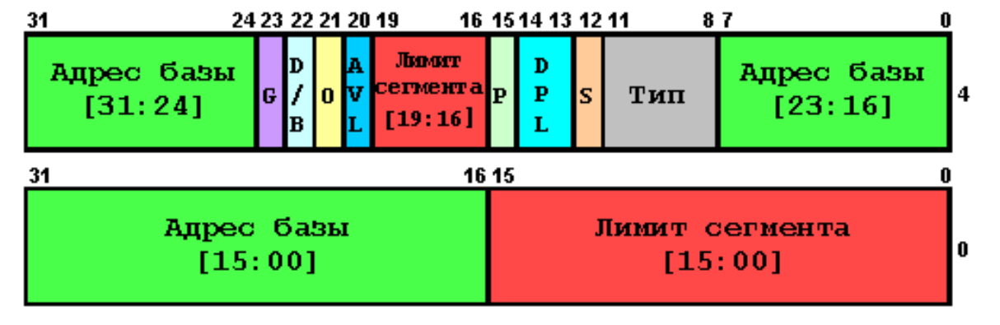

**Дескриптор** - это структура, описывающая сегмент, у каждого сегмента он собственный.

### <span style="color:#49FF49">Адрес базы</span>

Адрес нулевого байта описываемого сегмента в 4 Гб линейном адресном пространстве (т.е. адрес, с которого начинается сегмент). Процессор собирает в кучу три поля цвета и образует единый 32-х битный адрес.

### <span style="color:#FF4949">Лимит сегмента</span>

Определяет размер сегмента. Опять же, процессор собирает в кучу два поля и
формирует конечный, 20-битовый размер. Реальный лимит сегмента зависит от бита  <span style="color:#CC99FF">гранулярности (G-granularity)</span>;
* если <span style="color:#CC99FF">бит гранулярности</span> **сброшен** (0), то 20-битное значение и будет тем самым лимитом сегмента
* если <span style="color:#CC99FF">бит гранулярности</span> **установлен** (1), то всё 20-битное значение автоматически увеличивается в 1000h раз, т.е. если при <span style="color:#CC99FF">G</span>=0 мы измеряем размер в байтах, то при <span style="color:#CC99FF">G</span>=1 – в 4Кб единицах.

Например, если <span style="color:#CC99FF">G</span>=1 и поле <span style="color:#FF4949">«Лимит сегмента»</span> = 0000Fh (15 байт), то **реальный лимит** данного сегмента равен 0Fh*1000h=0F000h (61440). Но: к лимиту прибавляется либо 1, либо 1000h в зависимости от бита <span style="color:#CC99FF">G</span>.

Есть еще один бит, от которого зависит смысловое значение этого поля - <span style="color:#CCFFFF">бит направления роста сегмента (B-big)</span>;
- если **сброшен** (0), то разрешены все смещения от 0 до <span style="color:#FF4949">лимита</span>
- если **установлен** (1) – то все, кроме от 0 до <span style="color:#FF4949">лимита</span>.

В противном случае (если мы попытаемся обратится за пределы <span style="color:#FF4949">лимита</span>) – возникнет исключение главной защиты (#GP, general protection). Вообще говоря, <span style="color:#FF4949">лимиты</span> для этой цели и придуманы – отслеживать обращения в недоступные адресные пространства. <span style="color:#FF4949">Лимит</span>, очевидно, отсчитывается от адреса <span style="color:#49FF49">базы</span>.

### <span style="color:#C0C0C0">Тип</span>

Определяет тип сегмента, определяет права доступа к сегменту и направление роста сегмента
(помните <span style="color:#CCFFFF">бит B</span>). Зачение этого поля зависит от значения поля <span style="color:#FFCC99">«тип дескриптора»</span> [(S - descriptor type)](#s-descriptor-type--флаг-тип-дескриптора). Значение этого поля различно для разных типов сегментов (кода, данных и системного)

### <span style="color:#FFCC99">S (descriptor type) – флаг «тип дескриптора»</span>

*Коммент: не знаю почему в лекциях написано что S - "descriptor type". В инете этот бит обозначают за "System bit". Последний вариант более логичен, ведь бит позволяет отличить системный сегмент от несистемного*

Означает только одно: если сброшен (0), то описуемый сегмент – **системный**, если установлен (1) –
это сегмент данных или кода.

### <span style="color:#00FFFF">DPL (descriptor privilege level) – уровень привилегий дескриптора</span>

Определяет уровень привилегий сегмента. Т.к. это поле – двухразрядное, то соответственно может принимать только четыре различных значения (от 0 до 3). Самый крутой – нулевой уровень привилегий (ядро ОС). Это поле нужно для контроля за доступом к сегменту.

### <span style="color:#CCFFCC">P (segment present flag) – флаг присутствия сегмента</span>

Если установлен, значит сегмент присутствует непосредственно в памяти; если сброшен – соответственно, отсутствует. Этот флаг предназначен для организации работы при использовании страничной адресации (дело в том, что когда в сегментный регистр грузят селектор на дескриптор, в котором сброшен этот бит – возникает исключение #NP (segment-not- present exeption), поэтому, если отлавливать это самое #NP, можно вовремя подгрузить новую страницу в ОП из файла подкачки.

### <span style="color:#CC99FF">Гранулярность</span>

Флаг «гранулярности» [(см. Лимит)](#лимит-сегмента):

### <span style="color:#00CCFF">AVL (Available and reserved bits) – зарезервировано</span>

Это два бита (21-20 во втором двойном слове). Они вообще не стоят того, чтобы на них заострять внимание, но все же может кому и пригодиться: бит 20 может использоваться как угодно по вашему усмотрению, бит 21 всегда должен быть равен нулю.

### <span style="color:#CCFFFF">D/B</span>

- если **сброшен** (0), то разрешены все смещения от 0 до <span style="color:#FF4949">лимита</span>
- если **установлен** (1) – то все, кроме от 0 до <span style="color:#FF4949">лимита</span>.

Cледует отметить еще вот что: он определяет разрядность сегмента. Если установлен – значит сегмент 32-х разрядный, если сброшен – 16-ти. Это общий случай. Теперь частные:

- Сегмент кода. Для сегмента кода данный флаг называется **D** и устанавливает длину по умолчанию
для эффективных адресов и операндов в сегменте. Если установлен – то в сегменте допустимы 32-х
битные адреса и 32-х битные ИЛИ 8-ми битные операнды; Если сброшен – 16-битные адреса и 16-
битные ИЛИ 8-ми битные операнды.

- Сегмент стека. Для сегмента стека данный флаг называется B (big) флаг и устанавливает длину
указателя стека (регистр ESP) для команд push, pop и call. Если установлен – используется 32-х
разрядный указатель стека (т.е. регистр ESP использован по максимуму), если сброшен – то
используется только 16 бит (регистр SP, уже без E).

### Справочная информация о поле <span style="color:#FFCC99">«типа дескриптора»</span>

Все, что сейчас будет рассказано, справедливо только при <span style="color:#FFCC99">S</span>=1 (то есть сегмент либо кода, либо данных). 

11 бит во втором двойном слове (он же четвертый бит поля <span style="color:#C0C0C0">«Тип»</span>) показывает, является описуемый сегмент кодом или данными (0 – данные, 1 – код)

Если это сегмент данных, то младшие три бита поля <span style="color:#C0C0C0">«Тип»</span> (10-8) интерпретируются как бит E (expansion-direction) – рост направления, бит W (write-enable) – запись разрешена и бит A (accessed) – доступен.

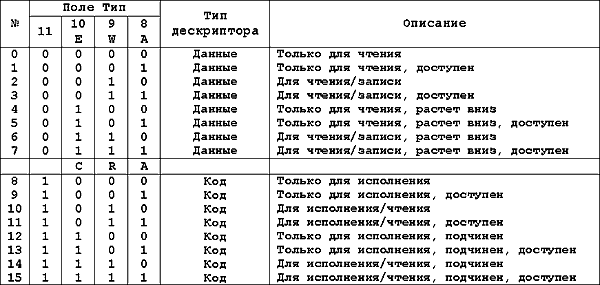

И вот здесь вас подстерегает один приятный сюрприз: оказывается, нет такого специального типа сегмента, как сегмент стека. Сегмент стека – это ни что иное, как сегмент данных, растущий вниз. Сегмент стека обязательно должен быть доступен для чтения/записи.

Для сегмента кода младшие три бита поля <span style="color:#C0C0C0">«Тип»</span> интерпретируются, как C (conforming) – подчиненный, R (read enable) – чтение разрешено и A (accessed) – доступен. Как видите, сегмент кода
может быть доступен как только для исполнения, так и для исполнения/чтения. Для исполнения/чтения он может быть доступен в том случае, когда мы храним какие-либо константы или
другие статические данные в памяти, непосредственно в сегменте кода. В защищенном режиме в сегмент кода писать нельзя.

Теперь, если <span style="color:#FFCC99">S</span>=0 (то есть сегмент системный): Процессор различает 6 типов системных дескрипторов:

- Дескриптор сегмента «таблица LDT»
- Дескриптор сегмента «состояние задачи»
- Дескриптор шлюза вызова (Call-Gate)
- Дескриптор шлюза прерывания (Interrupt-Gate)
- Дескриптор шлюза ловушки (Trap-Gate)
- Дескриптор шлюза задачи (Task-Gate)

В свою очередь, данные 6 дескрипторов делятся на две группы: дескрипторы системных сегментов (первые два) и дескрипторы шлюзов (все остальные). Самый первый (дескриптор сегмента «таблица LDT») нам уже хорошо знаком, остальные являются
более сложными. Тем не менее, таблица их распределения:

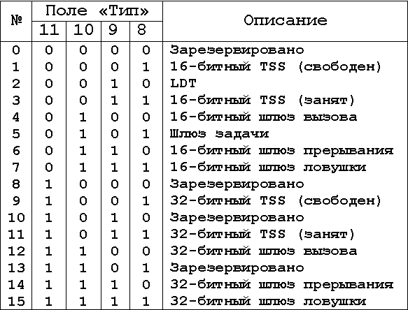

### Назначение

Дескрипторы сегментов  для  команд  и  данных  описывают,  в компактной форме,воспринимаемой процессором 80386, исключительно сегменты, существующие в памяти - т.е.	code  и  data  сегменты. Сегменты code и data  задаются	различными  типами  дескрипторов т.к.  только  code  сегмент  является  исполняемым,  а	с  целью обеспечения  надлежащей защиты  системы,  для  исполняемого  кода требуется другой набор атрибутов, нежели для данных.

Предусмотренные дескрипторы сегментов состояния задачи (TSS) позволяют умножать TSS-ы. Эта особенность  позволяет  процессору 80386 поддерживать многозадачность.  Активная  в  данный  момент задача индицируется селектором	в  регистре  задач  (TR)  и  TSS дескрипторе, описываемым  соответствующим  значением  селектора. 

Таким  же  образом,	 предусмотренные  дескрипторы	 таблиц локальных  дескрипторов  (LDT)	позволяют  умножать  LDT-ы.  Это позволяет каждой задаче в многозадачной архитектуре 80386  иметь свое  личное  локальное  адресное   пространство.   Активное   в настоящий момент локальное  адресное  пространство,  указываемое селектором в LDT регистре (LDTR),а  LDT  дескриптор  указывается соответствующим значением селектора.

# ​Экзаменационный билет №2

## ​Сегментные регистры и примеры их использования.

При использовании сегментированных моделей памяти для формирования любого адреса нужны два числа - адрес начала сегмента и смещение искомого байта относительно этого начала (в бессегментной модели памяти flat адреса начал всех сегментов равны). Операционные системы (кроме DOS) могут размещать сегменты, с которыми работает программа пользователя, в разных местах памяти и даже временно записывать их на диск, если памяти не хватает. Так как сегменты способны оказаться где угодно, программа обращается к ним, применяя вместо настоящего адреса начала сегмента 16-битное число, называемое селектором. В процессорах Intel предусмотрено 4 16-битных регистров - **CS, DS, ES, SS** , где хранятся селекторы. Это означает, что в любой момент можно изменить параметры, записанные в этих регистрах. Ни в каких логических и арифметических операциях эти регистры не могут участвовать. В них можно только писать и читать. Да и то, с ограничениями. **Эти регистры используются для сегментирования адресов**. Суть тут в следующем: в ПК, чтобы использовать полностью память требуется использовать длинные адреса. Но при использовании длинных адресов команды становятся тоже длинными. Из-за этого увеличивается размер программы. Поэтому поступают следующим образом: **заносят в сегментные регистр базовый адрес сегмента, и относительно него рассчитывают относительный адрес команды или данных**. Такой подход удобен при использовании нескольких сегментов. В Cs находится базовый адрес сегмента кода, в Ds – данных, в SS – стека и в ES – дополнительного сегмента. Особенно стоит отметить CS и SS: отвечают за сегменты двух особенных типов - сегмент кода и сегмент стека. Первый содержит программу, исполняющуюся в данный момент, следовательно, запись нового селектора в этот регистр приводит к тому, что далее будет исполнена не следующая по тексту программы команда, а команда из кода, находящегося в другом сегменте, с тем же смещением. Смещение очередной выполняемой команды всегда хранится в специальном регистре IP (указатель инструкции), запись в который также приведет к тому, что далее будет исполнена какая-нибудь другая команда. На самом деле все команды передачи управления - перехода, условного перехода, цикла, вызова подпрограммы и т. п. - и осуществляют эту самую запись в CS и IP.

## ​Способы адресации: непосредственная, прямая, косвенная, адресация по базе. Регистры-модификаторы.

Большинство команд процессора вызываются с аргументами, которые в ассемблере принято называть операндами. Например: команда сложения содержимого регистра с числом требует задани двух операндов — содержимого регистра и числа.

### ​Регистровая адресация

Операнды могут располагаться в любых регистрах общего назначения и сегментных регистрах. Для этого в тексте программы указывается название соответствующего регистра, например: команда, копирующая в регистр АХ содержимое регистра ВХ, записывается как

```asm
mov ax, bx
```

### ​Непосредственная адресация

Некоторые команды (все арифметические, кроме деления) позволяют указывать один из операндов непосредственно в тексте программы. Например: команда

```asm
mov ax,2
```

помещает в регистр АХ число 2.

### Прямая адресация

Если у операнда, располагающегося в памяти, известен адрес, то его можно использовать. Если операнд - слово, находящееся в сегменте, на который указывает ES, со смещением от начала сегмента 0001, то команда

```asm
mov ax,es:0001
```

поместит это слово в регистр АХ. В реальных программах для задания статических переменных обычно используют уже рассмотренные нами директивы определения данных, которые позволяют ссылаться на статические переменные не по адресу, а по имени. Тогда, если в сегменте, указанном в ES, была описана переменная word\_var размером в слово, можно записать ту же команду как

```asm
mov ax,es:word_var
```

В таком случае ассемблер сам заменит слово word\_var на соответствующий адрес. Если селектор сегмента данных находится в DS, то имя сегментного регистра при прямой адресации можно не указывать, DS используется по умолчанию. **Прямая адресация иногда называется адресацией по смещению**.

**Адресация отличается для реального и защищенного режимов**. В реальном (так же как и в режиме V86) смещение всегда 16-битное. Это значит, что ни непосредственно указанное смещение, ни результат сложения содержимого разных регистров в более сложных методах адресации не могут превышать границ слова.

При работе в Windows, DOS4G, PMODE и в других ситуациях, когда программа будет запускаться в защищенном режиме, смещение не должно превышать границ двойного слова.

### ​Косвенная адресация

По аналогии с регистровыми и непосредственными операндами адрес операнда в памяти также можно не указывать, а хранить в любом регистре. До процессора 80386 для этого можно было использовать только ВХ, SI, DI и ВР. Например, следующая команда помещает в регистр АХ слово из ячейки памяти, селектор сегмента которой находится в DS, а смещение - в ВХ:

```asm
mov ax,[bx]
```

Как и в случае с прямой адресацией, DS используется по умолчанию, но не всегда: если смещение берут из регистра ВР, то в качестве сегментного регистра применяется SS. В реальном режиме можно свободно работать со всеми 32-битными регистрами, надо только следить, чтобы их содержимое не превышало границ 16-битного слова.

```asm
MOV SI, OFFSET X
MOV AL, BYTE PTR [SI]
...
X DB 10 DUP(?)  ; [0; 9]
```

Вы помните оператор [], который обозначает индексное обращение – также напоминаю, что использовать его можно только с индексными регистрами (SI и DI, source index и destination index) и ещё двумя модификаторами, о которых позднее. В данном примере показан один из вариантов использования данных регистра и оператора для обращения к элементу массива Х. В данном случае si – не индекс массива, а адрес элемента в общей структуре памяти. **Такая адресация называется**** косвенной базовой (или регистровой)**.

Также к регистру SI в ней можно добавить смещение: `mov al, byte ptr [si+1]`, но это уже следующий метод адресации:

### ​Адресация по базе со сдвигом

Теперь скомбинируем два предыдущих метода адресации. Следующая команда `mov ax,[bx+2]` помещает в регистр АХ слово, которое есть в сегменте, указанном в DS, со смещением на два больше, чем число из ВХ. Так как слово занимает ровно 2 байта, эта команда поместила в АХ слово, непосредственно следующее за тем, которое было в предыдущем примере. Такая форма адресации используется в тех случаях, когда в регистре находится адрес начала структуры данных, а доступ надо осуществить к какому-нибудь ее элементу. Еще один вариант применения адресации по базе со сдвигом — доступ из подпрограммы к параметрам, переданным в стеке, используя регистр ВР в качестве базы и номер параметра в качестве смещения.

Другие допустимые формы записи этого способа адресации:

```asm
mov ax,[bp]+2
mov ax,2[bp]
```

До процессора 80386 в качестве базового регистра разрешалось использовать только ВХ, ВР, SI или DI и сдвиг мог быть только байтом или словом (со знаком). С помощью этого метода разрешается организовывать доступ к одномерным массивам байтов: смещение соответствует адресу начала массива, а число в регистре - индексу элемента массива, который надо считать. Очевидно, что, если массив состоит не из байтов, а из слов, придется умножать базовый регистр на два, а если из двойных слов - на четыре.

```asm
XOR SI, SI
MOV AL, BYTE PTR X[SI]

X DB 10 DUP(?) ;[0; 9]
```

Другой пример. Здесь Х берется за базовый адрес, от которого уже отсчитывается смещение в виде регистра SI. **Такая индексация называется косвенной индексной**. Её тоже можно использовать со смещением: `mov al, byte ptr x[si+1]`.

`адрес(X[i]) = X + (type X) * i`

При использовании косвенной индексной адресации индексный регистр автоматически умножается на тип Х (напоминаю, тип – размер элемента). Регистр **SI** в данном примере называется модификатором адреса, а полный адрес – исполнительным.

```asm
XOR SI, SI
MOV AL, BYTE PTR X[BX][SI]
...

A DB N DUP(M DUP(?))
; Регистр ВХ — модификатор
; Регистр SI — модификатор
; Полный адрес — исполнительный
```

`Аисп = (A + [BX] + [SI]) mod 2^16`

Если массив многомерный (объявлять такие можно благодаря вложенности конструкции DUP), то обращение к его элементам производится так же, как в С. Все необходимые модификации адреса (умножение значения регистра на размерность типа) будут осуществлены самим ассемблером. Здесь точно так же индексные регистры называются модификаторами адреса, а полный адрес – исполнительным.

```asm
MOV AX, A[BX]
```

Команда будет работать не с адресом A, а с исполнительным адресом (эффективным) Замена адреса на исполнительный – модификация адреса. Регистр, участвующий при модификации — модификатор

`Аисп = (A + [BX]) mod 2^16`

При использовании индексного оператора в косвенной индексной адресации команда работает не с базовым адресом, а с исполнительным (или эффективным). В процессе трансляции ассемблер преобразовывает адрес в исполнительный, используя модификатор.

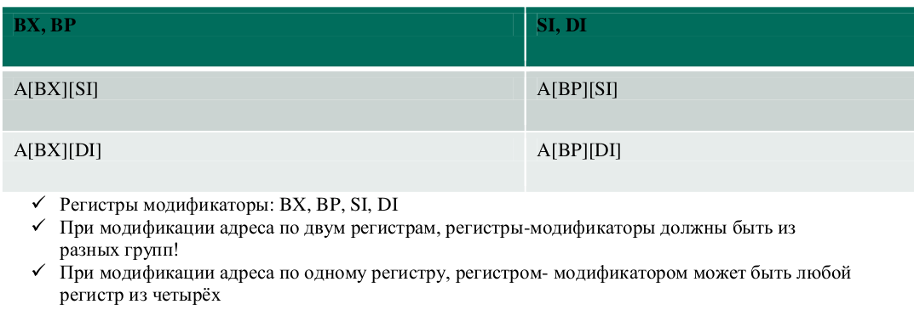

```asm
ADD A[SI], 5

;si = 100
```

`Аисп = А + [SI] = A + 100`

Косвенные ссылки

```asm
MOV [BX], 5  ; MOV 0[BX], 5
```

При отсутствии базового адреса (то есть когда используется косвенная базовая/регистровая адресация) он считается равным нулю. В таком случае при отсутствии оператора уточнения типа будут возникнуть ошибки неопределенного типа данных.

```asm
MOV BYTE PTR [BX], 5
```
Вторая строчка будет верно обработана компилятором.

**Заключать в квадратные скобки регистры – не модификаторы запрещено!**

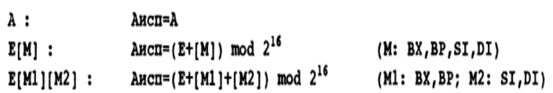

В операторе индексации могут участвовать только BX, BP, SI и DI. Любой другой регистр в них вызовет ошибку транслятора.

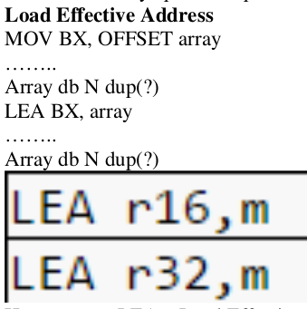

Инструкция LEA – Load Effective Address – загружает исполняемый (эффективный) адрес участка памяти в регистр без необходимости OFFSET-а. Участок памяти может быть задан не только в виде начального адреса массива, но и с помощью адресации. С помощью команды LEA можно вычислить адрес переменной, которая описана сложным способом адресации (например, по базе с индексированием, что часто используется при работе с массивами и строками). Оператор OFFSET позволяет определить смещение только при компиляции, и в отличие от него команда LEA может сделать это во время выполнения программы. Хотя в остальных случаях обычно вместо LEA используют MOV и OFFSET, то есть

```asm
LEA ПРИЁМНИК, ИСТОЧНИК
```

это то же самое, что и

```asm
MOV ПРИЁМНИК, offset ИСТОЧНИК
```

## ​Блоки повторений REPT, IRP, IRPC. Синтаксис, примеры использования.

### ​REPT – блоки

Простейший блок повторения REPT выполняет ассемблирование участка программы заданное число раз. Этот тип блоков повторения записывается следующим образом:

```asm
REPT k
    <тело>
ENDM
```

Тут k – константное выражение с неотрицательным значением. Это выражение должно быть таким, чтобы можно было вычислить его сразу (например, в нём не должно быть ссылок вперёд). Выражение должно иметь значение в виде 16-битового числа без знака и не может содержать внешних или неопределенных символов. Тело блока может включать в себя любые предложения языка. Вычислив значение k, макрогенератор создаёт k точных копий тела блока и подставляет их в окончательный текст программы.

Простейший пример:

```asm
REPT 10
    db 0
endm
```

Эквивалентно `db 10 dup(0)`

```asm
REPT 3
  SHR ax, 1
ENDM
```

Будет построен следующий фрагмент окончательной программы"

```asm
SHR ax, 1
SHR ax, 1
SHR ax, 1
```

Другой пример:

```asm
N EQU 6
REPT N-4
    DB 0,1
    DW ?
ENDM
```

Преобразуется в:

```asm
N EQU 6
DB 0,1
DW ?
DB 0,1
DW ?
```

В блоках повторения довольно часто используется директива присваивания. Например, описать 100-байтовый массив X (из примера выше) можно так:

```asm
X db 0
K=0

REPT 99
    K=K+1
    DB K
ENDM
```

Точно так же можно описать, например, фрагмент кода, который содержит в себе массив, состоящий из ASCII-кодов прописных букв:

```asm
sym='A'
symbols
rept 26
    db sym  
    sym=sym+1
endm
```

При подключении к компьютеру измерительного или управляющего оборудования иногда возникает необходимость замедлить работу процессора при обращении к портам этого оборудования. Замедление осуществляется включением в текст программы одной или, если требуется, нескольких команд безусловного перехода на следующее предложение:

```asm
in al, 300h
jmp a
a: jmp b
b: jmp c
c: in al, 301h
```

Для того, чтобы не создавать много ненужных, в сущности, меток, такого рода предложения часто записывают следующим образом:

```asm
in al, 300h
jmp $+2
jmp $+2
jmp $+2
in al, 301h
```

Такой фрагмент можно оформить в виде блока повторения: `rept 6 jmp $+2 endm`. Для упрощения можно использовать инструкцию nop (отсутствие операции).

### ​IRP-блоки

Блоки повторений, как и макроопределения, могут вызываться с параметрами. Для этого ипользуются директивы IRP/IRPC. Блоки повторений типа IRP имеют следующий вид:

```asm
IRP p,<v1,v2, …, vn>
    <тело>
ENDM
```

Тут **p** – некоторое имя, оно играет роль формального параметра и может использоваться в предложениях тела.

**Vi** – это фактические параметры. Это любые тексты (возможно, и пустые), но, чтобы не было путаницы, они должны быть сбалансированы по кавычкам и не должны содержать запятые, точки с запятой и уголки вне кавычек. Но это не беда, так как в ассемблере, как и в ЯВУ также есть экранирующий символ. Параметры vi перечисляются через запятую, а вся их совокупность обязательно заключается в угловые скобки. Встречая такой блок, макрогенератор изменяет его на m копий тела, причём в i-ой копии все вхождения имени p заменяются на Vi. Например:

```asm
IRP REG, <AX,CX,SI>
    PUSH REG
ENDM
```

Преобразуется в:

```asm
PUSH AX
PUSH CX
PUSH SI
```

Формальный параметр локализируется в теле блока (вне блока он будет недоступен) и может быть любым именем. Если оно совпадает с именем другого объекта программы, то в теле блока оно обозначает именно параметр, а не этот объект. Например:

```asm
IRP BX , <1,5>
    ADD AX, BX
ENDM
```

Этот кусок преобразуется в:

```asm
ADD AX, 1
ADD AX, 5
```

Фактический параметр того макроса назывался **BX**, но обозначал он совсем не регистр общего назначения. Также, в теле блока повторения заменяются только формальный параметр, другие имена (например, имена констант) переносятся в копии тела без изменений. Например:

```asm
N EQU 1
IRP P, <A,B>
    P EQU N
ENDM
```

Это преобразуется в:

```asm
N EQU 1
A EQU N; но не A EQU 1!
B EQU N
```

Можно использовать точно так же, как и `REPT`, для задания переменных:

```asm
IRP arg,<0,1,2,3>
    db arg
endm
```

преобразуется в

```asm
db 0
db 1
db 2
db 3
```

### ​IRPC-блоки

Блоки этого типа записываются так:

```asm
IRPC p,s1…sk
    <тело>
ENDM.
```

Тут **p** – формальный параметр, а вот **si** – это символы. Это могут быть любые символы, кроме пробелов, точек с запятой (с «;» начинается комментарий, а пробел заканчивает операнд. Если надо указать точке с запятой или пробел, то всю последовательность символов следует заключить в угловые скобки). Встречая `IRPC` блок, макрогенератор заменяет его на k копий тела блока (по одной на каждый символ), причём в i-й копии все вхождения параметра **p** будут заменены на символ **si**. Например:

```asm
IRPC D,17W
    ADD AX, D
ENDM
```

Заменится на:

```asm
ADD AX, 1
ADD AX, 7
ADD AX, W
```

Следующий блок задает строку в памяти, располагая после каждого символа строки атрибут OFh (белый символ на черном фоне), так что эту строку впоследствии можно будет скопировать прямо в видеопамять.

```asm
irpc character,<строка символов>
    db '&character&', OFh
endm
```

# ​Экзаменационный билет №3

## ​Способ адресации памяти в процессоре 8086. Каким образом он может адресовать до 1 Мб памяти?

Выше было сказано, что процессор в реальном режиме эмулирует работу процессора8086, он является 16-разрядным и работает с памятью до 1 Мб. Поэтому рассмотрим общую схему базирования адресов на данном процессоре. Программируя под данный процессор, обычно исходят из того, что он 16-разрядный, но каким тогда образом 16-разрядным адресом можно однозначно адресовать память, размером в 1 Мб, то есть в 2^20? Так как, если в оперативной памяти имеется 2^k ячеек, то для ссылок на эти ячейки нужны k-разрядные адреса. При большом объёме памяти, большим будет и размер адресов, а это ведёт к увеличению длины команд, что в свою очередь увеличивает длину программы в целом. Это не есть хорошо. Чтобы сократить размер команд, поступают следующим образом.

Память делят на условные участки, которые принято называть сегментами. Начальные адреса сегментов (их называют базами) могут быть любыми, а вот длины сегментов не должны превосходить 2^m ячеек, где m\<k.

Тогда, абсолютный адрес любой ячейки памяти А можно представить в виде суммы А=В+offs, где В – адрес базы сегмента, а offs – смещение относительно начала сегмента. Ограничение размера сегмента означает, что 0\<=offs\<=2^m -1, и поэтому, для записи смещений достаточно m разрядов. Следовательно, в сумме А = B+offs, большая часть адреса А приходится на базу B, а offs – это лишь небольшой добавок. Учитывая это, можно поступить следующим образом. Если в команде надо указать абсолютный адрес А, то большее слагаемое – базу В – «упрятываем» в некоторый регистр R, а в команде указываем лишь этот регистр и метшее слагаемое offs, т. Е получится так:

КОП … R offs …

Это уменьшает размер команд, что мы и хотели добиться. Повторюсь, размер памяти равен 1 Мб = 2^20 байт (k=20), поэтому абсолютные адреса здесь 20-разрядные, а размеры сегментов не должны превышать величину 64кб, т.е 2^16 байтов (m=16), поэтому-то смещения здесь и являются 16-разрядными. Общая схема базирования адресов предполагает, что размеры базовых (сегментных) регистров достаточно большие, ведь мы предполагаем, что начать сегмент можно в любом месте памяти, даже в самом конце (пусть, например, мы хотим разместить сегмент по адресу 0x77777, что вполне можем себе позволить, ведь этот адрес не превышает 1 Мб), но это противоречит тому факту, что процессор 8086 является 16-разрядным, а, значит, и разрядность его регистров тоже будет равна 16, каким же образом мы всё-таки можем тогда работать с памятью, размером до 1 Мб? А решается это следующим образом: мы до сих пор предполагали, что сегмент можно начинать с любого адреса, но, если начинать сегмент не просто с любого адреса, а с любого адреса, кратного 16, то получится следующая картина: крайние левые 4 бита адреса начала сегмента будут нулевыми, или, последняя цифра адреса начала сегмента в hex виде будет всегда 0! То есть адреса будет иметь вид: XXXX0. А раз так, то этот крайний правый нулик можно не писать, а просто его подразумевать. Это сэкономит нам целый разряд (в hex виде) и адрес примет вид XXXX, что как раз и умещается в 16-разрядное число. В компьютере так и делается. В сегментных регистрах указывается не весь адрес, а только первые 16 битов начального адреса сегмента, т.е. первые четыре шестнадцатеричные цифры. Например, если началом сегмента будет адрес 0x12340, то в сегментном регистре будет храниться число 0x1234. Начальный адрес сегмента (без последнего 0x0) называется номером сегмента и обозначается как seg. Тогда вычисление абсолютного (физического) адреса памяти A по значению пары SR:OFF, где SR – сегментный регистр, а OFF – смещение, будет иметь следующий вид: A = SR\*16 + OFF. При такой адресации адреса 0400h:0001h и 0000h:4001h будут ссылаться на одну и ту же ячейку памяти, так как 400h × 16 + 1 = 0 × 16 + 4001h. Минимальный адрес: 0000h:0000h (0 байт). Максимальный адрес: FFFFh:FFFFh (FFFFh × 16 + FFFFh) = 10FFEFh = 1 114 095 Б = 100000h + 10000h - 11h = 1 МиБ + 64 КиБ - 17 Б). Описанный способ вычисления физического адреса позволяет адресовать (1 МиБ + 64 КиБ - 17 Б + 1 Б) памяти (диапазон адресов 0000h…10FFEFh); 1 байт добавляется для учёта байта с нулевым адресом. Однако в процессорах 8086/8088 имеется всего 20 адресных линий (металлических дорожек), поэтому размер доступной памяти составляет 2^20 Б = 1 МиБ (диапазон адресов 0000h…FFFFFh), а при адресации выше (в диапазоне 100000h…10FFEFh) происходит переполнение («заворот») — старший

единичный бит адреса игнорируется, и происходит обращение к 64 КиБ в начальных адресах (0000h…FFEFh).

## ​Синтаксис описания макросов. Что такое макроопределение и макрокоманда?

**Макросы** : специальным образом описывается этот фрагмент программы (это и есть макрос) и ему дается имя, а затем в нужных местах программы выписывается ссылка на этот макрос (указывается его имя); когда макрогенератор просматривает текст программы и встречает такую ссылку, то он вместо неё подставляет в окончательный текст программы сам макрос – соответствующий фрагмент программы; и так делается для каждой ссылки на макрос, в каком бы место программы она ни встретилась. Описание макроса называется **макроопределением** , ссылка на макрос – **макрокомандой** , процесс замены макрокоманды на макрос – макроподстановкой, а результат такой подстановки – макрорасширением.

### ​Макроопределения

Одно из самых мощных языковых средств ассемблера — макроопределения. **Макроопределением** (или **макросом** ) называется участок программы, которому присвоено имя и который ассемблируется всякий раз, когда ассемблер встречает это имя в тексте программы. **Макрос начинается директивой MACRO и заканчивается ENDM**.

Описание макроса, т.е макроопределение, имеет следующий вид:

```asm
<имя макроса> MACRO <формальные параметры>
    <тело макроса>
ENDM
```

Директива MACRO - это заголовок макроопределения. В ней указывается имя и через запятую перечисляются формальные параметры, если необходимо. Формальные параметры позволяют копировать макрос не в неизменном виде, а с изменениями. Те величины,

которые необходимо будет изменить описываются формальными параметрами.

Замечание. Имена формальных параметров локальны по отношению к макросу, т.е. они могут совпадать с именами в основной программе, макрогенератор понимает их как параметры.

Завершает макроопределение директива ENDM. Не надо повторять имя макроса. Размещаться они могут в любом месте программы, но определение обязательно должно быть до первой ссылки на макрос либо в отдельном файле.

### ​Макрокоманда

**Макрокоманда** - обращение к макроопределению. Или указание макрогенератору на то, что на указанном месте необходимо подставить тело макроопределения. Итак, одна макрокоманда заменяется на группу команд, поэтому она и называется макро (большая).

Синтаксис макрокоманды:

`<имя макроса> [<фактические параметры>]`

Замечание. Фактические параметры можно разделять запятыми или пробелами. Формальные параметры макроопределения заменяются соответствующими фактическими параметрами макрокоманды.

Число фактических параметров должно быть равно числу формальных параметров, если фактических параметров больше, то лишние игнорируются, если формальных больше, считается что в качестве недостающих фактических указаны пустые тексты.

Действия макрогенератора:

1. макрогенератор находит макроопределение с указанным именем
2. в его теле заменяет все формальные параметры фактическими
3. полученное макрорасширение подставляет в программу вместо макрокоманды

Можно комбинировать макросы и блоки повторений.

```asm
define macro count
    value=0
    REPT count
        db value
        value=value+1
    endm
endm
```

С помощью блоков повторений и макросов можно даже описать аналог цикла for:

```asm
forloop macro start,stop,incr,statementList
     local top,done
     push ax
     mov ax,start
top: cmp ax,stop
     jge done
     IRP statement,<statementList>
        statement
     endm
     add ax,incr
     jmp top
done:
     pop ax
endm
```

```asm
xor bx,bx
xor cx,cx
forloop 20,5,-4,\<\<add bx,ax\>,\<sub cx,ax\>\>
```

&darr;

```asm
     push ax
     mov ax,20
top: cmp ax,5
     jge done
     add bx,ax
     sub cx,ax
     add ax,-4
     jmp top1
done:
     pop ax
```

То же самое можно записать с помощью специального оператора продолжения выражения **«\»**

```asm
xor bx,bx
xor cx,cx
forloop 20,5,-4,\
<\
    <add bx,ax>,\
    <sub cx,ax>\
>
```

В макросах также можно применять макрооператор &. Здесь он будет отделять формальный параметр от остальной строки, если нужно использовать формальный параметр вместе с какой-либо строкой. Используется, если формальный параметр является частью некоторого идентификатора, тогда последовательность символов, которая является формальным параметром отделяют от остальной строки символом &. Макрооператор & используется когда надо формальный параметр указать внутри строки.

```asm
defmas macro type, len
    mas&type d&type len dup (?)
endm

defmas b,10  ; после макроподстановки получим masb db 10 dup (?)
defmas w,20  ; после макроподстановки получим masw dw 20 dup (?)
```

Если в качестве фактического параметра макроса нужно передать пустую строку, она просто обособляется запятыми.

## ​Уровни привилегий в защищенном режиме. Как они используются в ОС Windows?

*лекция 9 стр 10*

Иногда (в частности – в ОС Windows) их называют кольца защиты (Protection Rings). Как уже было сказано – всего уровней привилегий 4: 0 – самый крутой, 3 – наименее привилегированный. В мире ОС в нулевом кольце располагается код ядра ОС, драйвера, обработчики исключений (тот же #GP). Хотя по задумке инженеров Intel дрова и другие сервисные программы должны располагаться в 1 или 2 кольце. 

Однако ОС Windows используют только два кольца: 0 и 3. В третьем – пользовательские
приложения и служебные сервисы ОС, в нулевом – все остальное (хотя это грубое разделение, но
примерно так все и выглядит).

Уровни привилегий: это CPL (Current Privilege Level) и DPL (Descriptor Privilege Level).

CPL – это текущий уровень привилегий, иначе говоря – уровень привилегий кода (задачи) исполняющейся в данный момент. Он хранится в битах 1-0 селектора. Т.е. под CPL отведено 2 бита – всего могут принять 4 значения. Где находиться сам селектор, хранящий CPL? В CS и нигде больше. Т.е. если в данный момент исполняется код обработчика #GP (и он решает, что сделать с программой, вызвавшей исключение) то CPL кода (этого самого обработчика #GP) = 0 (хотя и необязательно – все зависит от фантазии разработчика ОС, но логично предположить, что CPL обработчика #GP равен 0).

DPL – уровень привилегий СЕГМЕНТА. Храниться в дескрипторе каждого сегмента в таблице дескрипторов. Вообще вот посмотришь на предыдущий тип уровня привилегий – CPL. CPL – уровень привилегий кода, исполняющегося в данный момент. Но ведь код тоже находиться в каком-то сегменте! Так чем же они отличаются? Фразой «в данный момент». Вот их главное отличие. Ну и, помимо того, CPL относится только к сегментам кода (исполняющимся в данный момент), а DPL содержится в каждом дескрипторе, неважно что описывает этот дескриптор. Под него также отведено 2 бита. Процессор смотрит на поле DPL только при обращении к сегменту. Например, исполняется какая-то пользовательская программа.

Вдруг процессор встречает инструкцию:

`mov dword ptr DS:[00000000h],0` ; программа хочет записать ноль по адресу `DS:00000000h`
(а DS равно все равно чему, например, 1234h)

Тут процессор задумается: а можно ли этой подозрительной программе с CPL=3 записывать данные
туда, куда она намеревается это сделать? Тут же из селектора 1234h извлекается индекс (старшие 13
бит - 246h) и в таблице дескрипторов (в данном случае – текущей LDT) находится нужный дескриптор,
в котором процессор ищет в первую очередь поле DPL – допустим, там ноль. Т.е. уровень привилегий
сегмента, в который хочет писать программа, явно выше, чем тот, который у программы. Тут же
генерируется #GP, обработчик которого должным образом разрешит ситуацию. Может возникнуть
вопрос: а если программа «успеет» записать нолик до тех пор, пока процессор производит
необходимые проверки? Ответ: не успеет. #GP — это исключение типа ошибки (fault), оно всегда
генерируется до исполнения инструкции.

# ​Экзаменационный билет №4

## ​Строковые инструкции ассемблера. Префиксы повторений.

Префиксы повторения строковых операций. Количество повторений – в регистре CX, кроме того, REPZ/REPE повторяет, пока ZF равен нулю, а REPNZ/REPNE – пока не равен.

**Все перечисленные команды являются префиксами для операций над строками**. Любой из префиксов выполняет следующую за ним команду строковой обработки столько раз, сколько указано в регистре СХ, уменьшая его при каждом выполнении команды на 1. Кроме того, REPZ и REPE прекращают повторения команды, если флаг ZF сброшен в О, a REPNZ и REPNE прекращают повторения, если флаг ZF установлен в 1. Префикс REP обычно используется с командами MOVS, LODS, STOS, а префиксы REPE, REPNE, REPZ и REPNZ - с командами CMPS и SCAS. Поведение префиксов в других случаях не определено.

### ​Сравнение строк: CMPS

CMPS сравнивает пару элементов DS:SI с ES:DI. Также автоматически производит инкремент обоих указателей, при DF – 0.

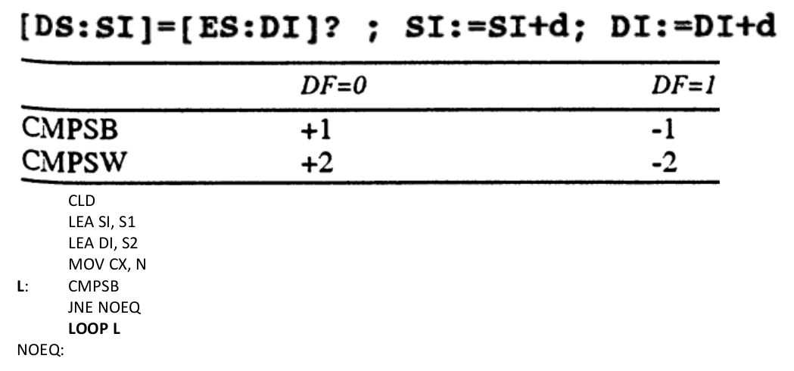

Сравнивает один байт (CMPSB) или слово (CMPSW) из памяти по адресу DS:SI с байтом или словом по адресу ES:DI и устанавливает флаги аналогично команде СМР. При использовании формы записи CMPS ассемблер сам определяет по типу указанных операндов (принято указывать имена сравниваемых строк, но можно использовать любые два операнда подходящего типа), какую из двух форм этой команды (CMPSB или CMPSW) выбрать.

Применяя CMPS с операндами, можно заменить регистр DS другим, воспользовавшись префиксом замены сегмента (ES:, GS:, FS:, CS:, SS:), регистр ES заменить нельзя. После выполнения команды регистры SI и DI увеличиваются на 1 или 2 (если сравниваются байты или слова), когда флаг DF = 0, и уменьшаются, когда DF = 1.

Команда CMPS с префиксами REPNE/REPNZ или REPE/REPZ выполняет сравнение строки длиной в СХ байтов или слов. В первом случае сравнение продолжается до первого совпадения в строках, а во втором — до первого несовпадения.

Сравнение строк: CMPS.

```asm
CLD
LEA SI, S1
LEA DI, S2
MOV CX, N
REPE CMPSB
JE EQ
NOEQ:
```

### ​Поиск в строке: SCAS.

REPNE SCASB ищет в строке элемент, равный AL. REPE SCASB ищет не равный.

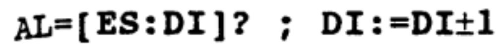

Сравнивает содержимое регистра AL (SCASB) или AX (SCASW) с байтом, словом или двойным словом из памяти по адресу ES:DI и устанавливает флаги аналогично команде СМР. При использовании формы записи SCAS ассемблер сам определяет по типу указанного операнда (принято указывать имя сканируемой строки, но можно использовать любой операнд подходящего типа), какую из двух форм этой команды (SCASB или SCASW) выбрать. После выполнения команды регистр DI увеличивается на 1 или 2 (если сканируются байты или слова), когда флаг DF = 0, и уменьшается, когда DF = 1. Команда SCAS с префиксами REPNE/REPNZ или REPE/REPZ выполняет сканирование строки длиной в СХ байтов или слов. В первом случае сканирование продолжается до первого элемента строки, совпадающего с содержимым аккумулятора, а во втором - до первого отличного.

### ​Пересылка строки: MOVS.

Копирует байт/слово из DS:SI в ES:DI. Инкрементирует/декрементирует указатели.

Копирует один байт (MOVSB) или слово (MOVSW) из памяти по адресу DS:SI в память по адресу ES:DI. При использовании формы записи MOVS ассемблер сам определяет по типу указанных операндов (принято указывать имена копируемых строк, но можно применять любые два операнда подходящего типа), какую из двух форм этой команды (MOVSB или MOVSW) выбрать. Используя MOVS с операндами, разрешается заменить регистр DS другим с помощью префикса замены сегмента (ES:, GS:, FS:, CS:, SS:), регистр ES заменить нельзя. После выполнения команды регистры SI и DI увеличиваются на 1 или 2 (если копируются байты или слова), когда флаг DF = О, и уменьшаются, когда DF = 1. Команда MOVS с префиксом REP выполняет копирование строки длиной в СХ байтов или слов.

```asm
CLD
LEA SI, Y
LEA DI, X
PUS  DS
POP ES
MOV CX, N
REP MOVSB

...

X DB N DUP(?)
Y DB N DUP(?)
```

### ​Сохранение строки: STOS.

Сохраняет содержимое AL/AX по адресу ES:DI. Изменяет указатели.

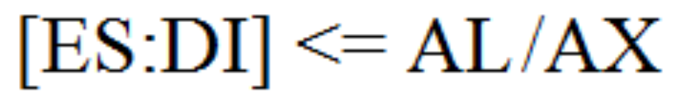

Копирует регистр AL (STOSB) или AX (STOSW) в память по адресу ES:DI. При использовании формы записи STOS ассемблер сам определяет по типу указанного операнда (принято указывать имя строки, но можно использовать любой операнд подходящего типа), какую из двух форм этой команды (STOSB или STOSW) выбрать. После выполнения команды регистр DI увеличивается на 1 или 2 (если копируется байт или слово), когда флаг DF = О, и уменьшается, когда DF = 1. Команда STOS с префиксом REP заполнит строку длиной в СХ числом, находящимся в аккумуляторе.

```asm
CLD
LEA DI, MEM
STOSB           ; Сохранить AL

LEA DI, X
CLD
XOR AL, AL
MOV CX, N
REP STOSB       ; Обнулить массив
X DB N DUP (?) 
```

### ​Загрузка строки: LODS.

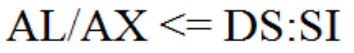

Считать значение в регистр AL/AX из памяти по адресу DS:SI

```asm
LEA SI, MEM
LODSB ; AL = *(BYTE *)MEM
```

Копирует один байт (LODSB) или слово (LODSW) из памяти по адресу DS:SI в регистр AL или АХ соответственно. При использовании формы записи LODS ассемблер сам определяет по типу указанного операнда (принято указывать имя строки, но можно использовать любой операнд подходящего типа), какую из двух форм этой команды (LODSB или LODSW) выбрать. Применяя LODS с операндом, можно заменить регистр DS на другой с помощью префикса замены сегмента (ES:, GS:, FS:, CS:, SS:). После выполнения команды регистр SI увеличивается на 1 или 2 (если считывается байт или слово), когда флаг DF = 0, и уменьшается, когда DF = 1. Команда LODS с префиксом REP выполнит копирование строки длиной в СХ, и в аккумуляторе окажется последний элемент строки. На самом деле LODS используют без префиксов, часто внутри цикла в паре с командой STOS, так, что LODS считывает число, другие команды выполняют над ним какие-нибудь действия, а затем STOS записывает измененное число на прежнее место в памяти.

Скопировать из массива X в массив Y числа с противоположным знаком.

```asm
   CLD
   LEA SI, X
   PUSH DS
   POP ES
   LEA DI, Y
   MOV CX, N
L: LODSB
   NEG AL
   STOSB
   LOOP L
```

## ​Перечислите команды условного и безусловного перехода, циклы. Приведите примеры их использования.

### ​Прямой переход

#### JMP op - безусловный переход

JMP передает управление в другую точку программы, не сохраняя какой-либо информации для возврата. Операндом может быть непосредственный адрес для перехода (в программах использую­т имя метки, установленной перед командой, на которую выполняется переход), а также регистр или переменная, содержащая адрес. В зависимости от типа перехода различают:

- переход типа short (короткий переход) - если адрес перехода находится в пределах -128...+ 127 байт от команды JMP;
- переход типа near (ближний переход) - если адрес перехода находится в том же сегменте памяти, что и команда JMP;
- переход типа far (дальний переход) - если адрес перехода находится в другом сегменте. Дальний переход может выполняться и в тот же самый сегмент при условии, что в сегментной части операнда указано число, совпадающее с текущим значением CS;
- переход с переключением задачи - передача управления другой задаче в многозадачной среде, в реальном режиме нас такой переход не интересует.

При выполнении переходов типа short и near команда JMP фактически преобразовывает значение регистра IP, изменяя тем самым смещение следующей исполняемой команды относительно начала сегмента кода. Если операнд - регистр или переменная в памяти, то его показатель просто копируется в IP, как если бы это была команда MOV. Если операнд для JMP - непосредственно указанное число, то его значение суммируется с содержимым EIP, приводя к относительному переходу. В ассемблерных программах в качестве операнда обычно указывают имена меток, но на уровне исполняемого кода ассемблер вычисляет и записывает именно относительные смещения.

Выполняя дальний переход в реальном, виртуальном и защищенном режимах (при переходе в сегмент с теми же привилегиями), команда JMP просто загружает новое значение в IP и новый селектор сегмента кода в CS, используя старшие 16 бит операнда как новое значение для CS и 16 в качестве значения IP.

Op указывает на адрес перехода, т е на адрес команды которая будет выполнена следующей. При программировании на ЯА адрес нужной команды не надо самому высчитывать. Достаточно на неё поставить метку и ассемблер сам подставит нужный адрес. Адрес следующей команды хранится в IP регистре. Поэтому, чтобы совершить переход, его нужно изменить. Казалось бы, пусть бы команда jmp просто меняла бы это регистр и всё. Но делается немного иначе. В ПК в команде перехода указывается не полный адрес нужной команды, а разница между текущим адресом и адресом команды. (Если точно, то относительный адрес отсчитывается не от самой команды перехода, а от следующей за ней). В ПК существуют разные машинные команды перехода, в одной из которых относительный адрес перехода задаётся в виде байта (короткий переход), а в другой в виде слова (длинный переход). В каждой из них, операнд рассматривается как целое со знаком. Две команды существуют потому, что если бы мы указывали всегда длинный переход, то под операнд приходилось бы всегда отводить два байта. Однако, на практике, большинство переходов являются короткими, то есть переходы на команды, которые недалеко друг от друга. Если указывать разницу, то она будет помещаться в байт. В 8086 **оp** не может быть непосредственным операндом. Короткий переход ассемблер подставляет по умолчанию только в том случае, если переход совершается назад. Только тогда он может высчитать разницу адресов и подставить полученной значение в качестве операнда. Но, если переход совершается вперёд, то ассемблер «подстраховывается» и вставляет полный адрес, так как заранее не может вычислить разницу. Если программист уверен, что переход вперёд короткий, то он может использовать оператор SHORT. Тогда ассемблер закодирует операнд размером в байт. Но, если мы ошиблись с SHORT, то ассемблер зафиксирует ошибку.

### ​Косвенный переход

#### JMP r16 или JMP m16

Тут берётся содержимое регистра или адреса слова памяти и по нему совершается переход. Причём, этот адрес рассматривается как полный, а не отсчитанный от команды перехода. Рассмотрим пример. Пусть у нас есть идентификатор L. Если он – метка, то будет совершён прямой переход. А если это имя переменной, то совершится косвенный переход по содержимому в этой ячейки памяти. Тут всё понятно, если L описано до команды перехода. Если после, то возникает неоднозначность. То есть ассемблер не будет знать, какой переход собирать, прямой или косвенный. Чтобы убрать неопределённость, ассемблер всегда считает, что L – метка. Если нам самим надо сделать косвенный переход, то нужно использовать уже известный нам оператор WORD PTR L.

### ​ **Условные переходы** :

#### j** op1 - условный переход

Это набор команд, выполняющих переход (типа short или near), если удовлетворяется

соответствующее условие, которым в каждом случае реально является состояние тех или иных флагов. Но, когда команда из набора J\*\* используется сразу после СМР, условия приобретают формулировки, соответствующие отношениям между операндами СМР. Например, если операнды СМР были равны, то команда JE, выполненная сразу после СМР, осуществит переход. Операнд для всех команд из набора J\*\* - 8-битное смещение относительно текущей команды. Команды J\*\* не поддерживают дальних переходов, поэтому, если требуется выполнить условный переход на дальнюю метку, необходимо использовать команду из набора J\*\* с обратным условием и дальний JMP, как, например:

```asm
cmp ах,0
jne local_1
jmp far_label ; Переход, если АХ = 0.
local_1:
```

Есть эквивалентные команды:
`Jz/je, jne/jnz, jb/jc,jnb/jnc`

### ​Циклы

#### JCXZ op1 - переход, если CX=0

Выполняет ближний переход на указанную метку, если регистр СХ равен нулю. Так же как и команды из серии J\*\*, JCXZ не может выполнять дальних переходов. Проверка равенства СХ нулю, например, может потребоваться в начале цикла, организованного командой LOOPNE, - если в него войти с СХ = 0, то он будет выполнен 65 535 раз.

#### LOOP op1 - цикл

Уменьшает регистр СХ на 1 и выполняет переход типа short на метку (которая не может быть дальше расстояния -128...+ 127 байт от команды loop), если СХ не равен нулю. Эта команда используется для организации циклов, в которых регистр СХ играет роль счетчика. Так, в следующем фрагменте команда ADD выполнится 10 раз:

```asm
mov cx, 0Ah
loop_start:
    add ax,cx
loop loop_start
```

Команда LOOP полностью эквивалентна паре команд

```asm
dec cx
jnz метка
```

Но **LOOP короче этих двух команд на один байт и не изменяет значения флагов**.

**LOOPE** op1 **- цикл, пока равно**

**LOOPZ** op1 **- цикл, пока ноль**

**LOOPNE** op1 **- цикл, пока не равно**

**LOOPNZ** op1 **- цикл, пока не ноль**

Все перечисленные команды уменьшают регистр СХ на один, после чего выполняют переход типа short, если СХ не равен нулю и если выполняется условие.

Для команд LOОРЕ и LOOPZ условием является равенство единице флага ZF, для команд LOOPNE и LOOPNZ - равенство флага ZF нулю. Сами команды LOOP\*\* не изменяют значений флагов, так что ZF должен быть установлен (или сброшен) предшествующей командой. Например, следующий фрагмент копирует строку из DS:SI в строку в ES:DI, пока не кончится строка (СХ = 0) или пока не встретится символ с ASCII-кодом 13 (конец строки):

```asm
mov cx,str_length
move_loop:
    lodsb
    stosb
    cmp al,13
loopnz move_loop
```

## ​Исключение #GP в защищенном режиме. Приведите примеры ситуаций, в которых оно возникнет.

*лекция 9 стр 9* 

Процессор сгенерирует исключение #GP в следующих случаях:

* Обращение к байту по смещению БОЛЬШЕМУ, чем эффективный лимит
* Обращение к слову по смещению БОЛЬШЕМУ, чем (эффективный лимит-1)
* Обращение к двойному слову по смещению БОЛЬШЕМУ, чем (эффективный лимит-3)
* Обращение к учетверенному слову по смещению БОЛЬШЕМУ, чем (эффективный лимит-7)

---

Процессор проверяет также лимиты таблиц дескрипторов, инфа о которых содержится в регистрах GDTR, IDTR, LDTR и TR. #GP будет сгенерировано, если произойдет попытка обращения к дескриптору, лежащему за пределами таблицы дескрипторов.

---

* в регистр CS загрузить селектор на дескриптор, который описывает отличный от сегмента кода сегмент;
* в регистры DS,ES,FS или GS загрузить селектор на дескриптор, который описывает «НЕЧИТАЕМЫЙ» сегмент кода;
* в регистр SS загрузить селектор на дескриптор, описывающий отличный от «ЧИТАЕМЫЙ сегмент ДАННЫХ» сегмент;
* в регистр LDTR загрузить селектор, не указывающий на LDT;
* при записи в «ИСПОЛНЯЕМЫЙ» сегмент (т.е. писать в сегмент кода нельзя через CS, через DS - можно);
* при записи в сегмент данных, который «ТОЛЬКО ДЛЯ ЧТЕНИЯ»;
* при чтении из «НЕЧИТАБЕЛЬНОГО ИСПОЛНИМОГО» сегмента;
* дескрипторы в таблице IDT должны быть шлюзами прерывания, ловушки или задачи;

---

* Если в CS или SS загрузить селектор, который указывает на нулевой дескриптор (т.е. 16-разрядное число, биты 15-3 которого равны 0), то #GP возникнет немедленно;
* Если нулевой селектор загрузить в DS,ES,FS или GS то #GP возникнет при попытке обращения к данным через такой селектор (иначе – он там может хоть сто лет пролежать). Вообще нулевой селектор придуман в качестве подстраховки от ненужных обращений к сегментам.

# ​Экзаменационный билет №5

## ​Регистр флагов. Перечислите флаги процессора и их назначения.

Еще один важный регистр, использующийся при выполнении большинства команд, - регистр флагов FLAGS. В FLAGS каждый бит является флагом, то есть устанавливается в 1 при определенных условиях или установка его в 1 изменяет поведение процессора.

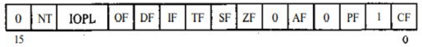

 * CF - флаг переноса. Устанавливается в 1, если результат предыдущей операции не уместился в приемнике и произошел перенос из старшего бита и если требуется заем (при вычитании), в противном случае - в 0. Например, после сложения слова OFFFFh и 1, если регистр, в который надо поместить результат, - слово, в него будет записано OOOOh и флаг CF = 1. 
 * PF - флаг четности. Устанавливается в 1, если младший байт результата предыдущей команды содержит четное число битов, равных 1, и в 0, если нечетное. Это не то же самое, что делимость на два. Число делится на два без остатка, если его самый младший бит равен нулю, и не делится, когда он равен 1.
 * AF - флаг полупереноса или вспомогательного переноса. Устанавливается в 1, если в результате предыдущей операции произошел перенос (или заем) из третьего бита в четвертый. Этот флаг используется автоматически командами двоично-десятичной коррекции.
 * ZF - флаг нуля. Устанавливается в 1, если результат предыдущей команды – ноль
 *  SF - флаг знака. Он всегда равен старшему биту результата.
 *  TF - флаг ловушки. Он был предусмотрен для работы отладчиков, не использующих защищенный режим. Установка его в 1 приводит к тому, что после выполнения каждой программной команды управление временно передается отладчику (прерывание 1)
 * IF - флаг прерываний. Сброс этого флага в 0 приводит к тому, что процессор перестает обрабатывать прерывания от внешних устройств (см. описание команды INT). Обычно  его сбрасывают на короткое время для выполнения критических участков кода.
 * DF — флаг направления. Он контролирует поведение команд обработки строк: когда он установлен в 1, строки обрабатываются в сторону уменьшения адресов, когда DF = 0 - наоборот.
 * OF - флаг переполнения. Он устанавливается в 1, если результат предыдущей арифметической операции над числами со знаком выходит за допустимые для них пределы. Например, если при сложении двух положительных чисел получается число со старшим битом, равным единице, то есть отрицательное, и наоборот.

## ​Логические инструкции ассемблера, распространенные способы их применения.

AND, OR, NOT, XOR

### ​ **and** op1, op2 - логическое И

Команда выполняет побитовое «логическое И» над приемником (регистр или переменная) и источником (число, регистр или переменная; источник и приемник не могут быть переменными одновременно) и помещает результат в приемник. Любой бит результата равен 1, только если соответствующие биты обоих операндов были равны 1, и равен 0 в остальных случаях. Наиболее часто AND применяют для выборочного обнуления отдельных битов. Например, команда

```asm
and аl,00001111b
```

обнулит старшие четыре бита регистра AL, сохранив неизменными четыре младших. Флаги OF и CF обнуляются, SF, ZF и PF устанавливаются в соответствии с результатом, AF не определен.

### ​ **or** op1, op2 - логическое ИЛИ

Выполняет побитовое «логическое ИЛИ» над приемником (регистр или переменная) и источником (число, регистр или переменная; источник и приемник не могут быть переменными одновременно) и помещает результат в приемник. Любой бит результата равен 0, только если соответствующие биты обоих операндов были равны 0, и равен 1 в остальных случаях. Команду OR чаще всего используют для выборочной установки отдельных битов. Например, команда

```asm
or al,00001111b
```

приведет к тому, что младшие четыре бита регистра AL будут установлены в 1. При выполнении команды OR флаги OF и CF обнуляются, SF, ZF и PF устанавливаются в соответствии с результатом, AF не определен.

### ​ **xor** op1, op2 - логическое исключающее ИЛИ

Выполняет побитовое «логическое исключающее ИЛИ» над приемником (регистр или переменная) и источником (число, регистр или переменная; источник и приемник не могут быть переменными одновременно) и помещает результат в приемник. Любой бит результата равен 1, если биты операндов различны, и нулю - в противном случае. XOR используется для

самых разных операций, например:

```asm
хог ах,ах ; Обнуление регистра АХ.
```

Или

```asm
хог ах,bх
хог bх,ах
хог ах,bх ; Меняет местами содержимое АХ и ВХ.
```

Оба примера могут выполняться быстрее, чем соответствующие очевидные команды

```asm
mov ax,0
```

или

```asm
xchg ax, bх
```

### ​ **not** op1 - инверсия

Каждый бит приемника (регистр или переменная), равный нулю, устанавливается в 1, и каждый бит, равный 1, сбрасывается в 0. Флаги не затрагиваются.

### **test** op1, op2

Команда TEST выполняет операцию поразрядного логического И между соответствующими парами битов операндов и, в зависимости от полученного результата, устанавливает флаги состояния процессора. При этом, в отличие от команды AND, значение операнда получателя данных не изменяется. В команде TEST используются аналогичные команде AND типы операндов. Обычно команда TEST применяется для анализа значения отдельных битов числа по маске

Пример: тестирование нескольких битов. С помощью команды TEST можно определить состояние сразу нескольких битов числа. Предположим, мы хотим узнать, установлен ли нулевой и третий биты регистра AL. Для этого можно воспользоваться такой командой:

```asm
test al,00001001b   ; Тестируем биты 0 и 3
```
Как показано в приведенных ниже примерах, флаг нуля ZF будет установлен только в том случае, если все тестируемые биты сброшены:

```
0 0 1 0 0 1 0 1   <- Исходное значение
0 0 0 0 1 0 0 1   <- Маска
0 0 0 0 0 0 0 1   <- Результат: ZF = 0

0 0 1 0 0 1 0 0   <- Исходное значение
0 0 0 0 1 0 0 1   <- Маска
0 0 0 0 0 0 0 0   <- Результат: ZF = 1
```

**Флаги**. Команда TEST всегда сбрасывает флаги переполнения (OF) и переноса (CF). Кроме того, она устанавливает значения флагов знака (SF), нуля (ZF) и четности (PF) в соответствии со значением результата выполнения операции логического И (как и команда AND).

### **cmp** op1, op2

Команда СМР вычитает исходный операнд из операнда получателя данных и, в зависимости от полученного результата, устанавливает флаги состояния процессора. При этом, в отличие от команды SUB, значение операнда получателя данных не изменяется.

В команде СМР используются аналогичные команде AND типы операндов.

**Флаги**.  Команда  СМР  изменяет  состояние  следующих  флагов:  CF  (флаг  переноса),  ZF  (флаг нуля),  SF  (флаг  знака),  OF  (флаг  переполнения),  AF  (флаг  служебного  переноса),  PF  (флаг  четности). Они устанавливаются в зависимости от значения, которое было бы получено в результате применения команды  SUB.

Команда СМР очень важна, поскольку она используется практически во всех основных условных логических конструкциях. Если после команды СМР поместить команду условного перехода, то полученная конструкция на языке ассемблера будет аналогична оператору IF языка высокого уровня.

**Примеры**. Теперь давайте рассмотрим три фрагмента кода, в которых продемонстрировано влияние команды СМР на флаги состояния процессора. При сравнении числа 5, находящегося в регистре ЕАХ, с числом 10, устанавливается флаг переноса CF, поскольку при вычитании числа 10 из 5 происходит заем единицы:

```asm
mov eax, 5
cmp eax, 10  ; CF = 1
```

При сравнении содержимого регистров еах и есх, в которых содержатся одинаковые числа 1000, устанавливается флаг нуля (ZF), так как в результате вычитания этих чисел получается нулевое значение:

```asm
mov eax, 1000
mov ecx, 1000
cmp ecx, eax  ; ZF = 0 и CF = 0
```

## ​Программные сегменты. Определение, упрощенные и стандартные директивы сегментации.

### ​Программные сегменты

- Повторное использование кода
- Логическое разграничение кода
- Параметризация кода

Физически **сегмент** представляет собой область памяти, занятую командами и (или) данными, адреса которых вычисляются относительно значения в соответствующем сегментном регистре.

Каждая программа содержит 3 типа сегментов:

- **Сегмент кодов** – содержит машинные команды для выполнения. Обычно первая выполняемая команда находится в начале этого сегмента, и операционная система передает управление по адресу данного сегмента для выполнения программы. Регистр сегмента кодов (CS) адресует данный сегмент.
- **Сегмент данных** – содержит данные, константы и рабочие области, необходимые программе. Регистр сегмента данных (DS) адресует данный сегмент.
- **Сегмент стека** — содержит адреса возврата как для программы (для возврата в операционную систему), так и для вызовов подпрограмм (для возврата в главную программу), а также используется для передачи параметров в процедуры. Регистр сегмента стека (SS) адресует данный сегмент. Адрес текущей вершины стека задается регистрами SS:SP.

### ​Упрощенные директивы сегментации

- **.CODE — для указания начала сегмента кода;**
- **.DATA — для указания начала сегмента данных;**
- **.STACK — для указания начала сегмента стека.**

**Однако** использование упрощенных директив сегментации не позволяет создать более трех сегментов для одной программы**.

### ​Стандартные директивы сегментации

Наряду с упрощенными директивами сегментации может также использоваться стандартная директива **SEGMENT** , которая определяет начало любого сегмента. Синтаксис:

```asm
ИмяСегмента SEGMENT Параметры
ИмяСегмента ENDS
```

Директива **ENDS** определяет конец сегмента. Параметры - readonly, выравнивание, тип, разряд, класс. Все пять являются необязательными.

Если в программе есть несколько сегментов с одним именем, то они соединяются в один

*(пропустил большой кусок про параметры)*

Все сегменты сами по себе равноправны, так как директивы **SEGMENT** и **ENDS** не содержат информации о функциональном назначении сегментов. Для того чтобы использовать их как сегменты кода, данных или стека, необходимо предварительно сообщить транслятору об этом, для чего используют специальную директиву **ASSUME**. Эта директива сообщает транслятору о том, какой сегмент к какому сегментному регистру привязан. В свою очередь, это позволит транслятору корректно связывать символические имена, определенные в сегментах.

# ​Экзаменационный билет №6

## ​Представление целых чисел в памяти компьютера.

Еще одно важное замечание: в компьютерах с процессорами Intel все данные хранятся так, что младший байт находится по младшему адресу, поэтому слова записываются задом наперед, то есть сначала (по младшему адресу) - последний (младший) байт, а потом (по старшему адресу) - первый (старший) байт. Если из программы всегда обращаться к слову как к слову, а к двойному слову как к двойному слову, это не оказывает никакого влияния. Но если вы хотите прочитать первый (старший) байт из слова в памяти, то придется увеличить адрес на 1. Двойные и учетверенные слова записываются так же - от младшего байта к старшему. Эта запись называется **little-endian** нотацией, которая противоположна **big-endian** – когда сначала записываются старшие разряды, а затем младшие, как это происходит в десятичных числах.

## ​Инструкции пересылки в ассемблере.

Одна из основных команд языка ассемблер – это команда пересылки. С её помощью можно записать в регистр значение другого регистра, константу или значение ячейки памяти, а также можно записать в ячейку памяти значение регистра или константу. Команда имеет следующий синтаксис:

### ​MOV \<операнд1\>, \<операнд2\>

По команде MOV значение второго операнда записывается в первый операнд. Операнды должны иметь одинаковый размер. Команда не меняет флаги.

1. `mov ax, bx` ; Пересылаем значение регистра EBX в регистр EAX
2. `mov ax, 0ffh` ; Записываем в регистр EAX шестнадцатеричное значение ff
3. `mov x, 0` ; Записываем в переменную x значение 0
4. `mov ax, x` ; Переслать значение из одной ячейки памяти в другую нельзя.

   `mov y, ax` ; Но можно использовать две команды MOV.

На самом деле процессор имеет много команд пересылки – код команды зависит от того, куда и откуда пересылаются данные. Но компилятор языка ассемблера сам выбирает нужный код в зависимости от операндов, так что, с точки зрения программиста, команда пересылки только одна.

Для перестановки двух величин используется команда обмена:

### ​XCHG \<операнд1\>, \<операнд2\>

Каждый из операндов может быть регистром или ячейкой памяти. Однако переставить содержимое двух регистров можно, а двух ячеек памяти – нет. Операнды должны иметь одинаковый размер. Команда не меняет флаги.

## ​Работа со стеком. По какому принципу идёт адресация локальных переменных подпрограмм и её аргументов в стеке?

**Стек** - организованный специальным образом участок памяти, который используется для временного хранения переменных, передачи параметров вызываемым подпрограммам и сохранения адреса возврата при вызове процедур и прерываний. Легче всего представить стек в виде стопки листов бумаги (это одно из значений слова «stack» в английском языке) — вы можете класть и забирать листы только с вершины стопки. Поэтому, если записать в стек числа 1, 2, 3, то при чтении они окажутся в обратном порядке - 3, 2, 1. Стек располагается в сегменте памяти, описываемом регистром SS, и текущее смещение вершины стека отражено в регистре SP, причем во время записи значение этого смещения уменьшается, то есть он «растет вниз» от максимально возможного адреса. Такое расположение стека «вверх ногами» может быть необходимо, к примеру, в бессегментной модели памяти, когда все сегменты, включая сегменты стека и кода, занимают одну и ту же область - память целиком. Тогда программа исполняется в нижней области памяти, в области малых адресов, и IP растет, а стек располагается в верхней области памяти, и SP уменьшается. При вызове подпрограммы параметры в большинстве случаев помещают в стек, а в ВР записывают текущее значение SP. Если подпрограмма использует стек для хранения локальных переменных, SP изменится, но ВР можно будет использовать для того, чтобы считывать значения параметров напрямую из стека (их смещения запишутся как ВР + номер параметра).

# ​Экзаменационный билет №7

## ​Типы данных в ассемблере и их преобразование. Оператор явного указания типа и примеры его использования.

ассемблер запоминает размер переменной, который берёт из объявления. Этот размер называется ТИПОМ ИМЕНИ переменной (в ассемблере тип – это всего лишь размер, т.е. число.

По команде mov можно переслать байт или слово. При пересылке, размеры обоих операндов должны совпадать, иначе ассемблер зафиксирует ошибку. Когда в операции пересылки участвует указатель на память, то размер этого операнда определяется исходя из типа данного указателя. Но очень часто указатели хранятся в регистрах, а, следовательно, ассемблеру определить тип не получится. В этом случае, программист должен сам, явно указать его. Делается это с помощью оператора указания типа PTR. Например,

```asm
mov [si], 0
```

Тут нельзя понять, какого размера 0 пересылается, байта или слова. Тоже касается и первого операнда. Непонятно, записать нужно 0 в байт по адресу si или в слово. В подобных ситуациях ассемблер фиксирует ошибку. Чтобы избежать этой ошибки, существует вышеупомянутый оператор.

```asm
<тип> PTR <выражение>
```

Если оператор указания типа относится ко второму операнду

```asm
Mov [si], byte ptr 0
```

То он [оператор] будет константным выражением. В данном случае считается, что 0 представляется как байт. Кстати, конструкции вида byte ptr 300 или word ptr 70000 будут вызывать ошибки, так как число 300 не может влезть в один байт, так же, как и число 70000 не влезает в слово. Если оператор относится к первому операнду, то оператор относится к адресным выражениям. Обычно принято уточнять тип операнда-адрес.

## ​Инструкции арифметического, логического и циклического сдвига. Их применение.

### ​ **Арифметические сдвиги**

`sar op1, op2` - **арифметический сдвиг вправо**

`sal op1, op2` - **арифметический сдвиг влево**

`shl op1, op2` - **логический сдвиг вправо**

`shr op1, op2` - **логический сдвиг влево**

 Эти четыре команды выполняют двоичный сдвиг приемника (регистр или переменная) вправо (в сторону младшего бита) или влево (в сторону старшего бита) на значение счетчика (число или регистр CL, из которого учитываются только младшие 5 бит, принимающие значения от 0 до 31). Операция сдвига на 1 эквивалентна умножению (сдвиг влево) или делению (сдвиг вправо) на 2. Так, число 0010b (2) после сдвига на 1 влево превращается в 0100b (4). Команды SAL и SHL выполняют одну и ту же операцию (на самом деле это одна и та же команда) - на каждый шаг сдвига старший бит заносится в CF, все биты сдвигаются влево на одну позицию, и младший бит обнуляется. Команда SHR осуществляет прямо противоположную операцию: младший бит заносится в CF, все биты сдвигаются на 1 вправо, старший бит обнуляется. Эта команда эквивалентна беззнаковому целочисленному делению на 2. Команда SAR действует по аналогии с SHR, только старший бит не обнуляется, а сохраняет предыдущее значение, вот почему, например, число 11111100b (-4) перейдет в 11111110b (-2). SAR, таким образом, эквивалентна знаковому делению на 2, но, в отличие от IDIV, округление происходит не в сторону нуля, а в сторону отрицательной бесконечности. Так, если разделить —9 на 4 с помощью IDIV, получится -2 (и остаток -1), а если выполнить арифметический сдвиг вправо числа -9 на 2, результатом будет -3. Сдвиги больше 1 эквивалентны соответствующим сдвигам на 1, выполненным последовательно.

Сдвиги на 1 изменяют значение флага OF: SAL/SHL устанавливают его в 1, если после сдвига старший бит изменился (то есть старшие два бита исходного числа не были одинаковыми), и в 0, если старший бит остался тем же. SAR устанавливает OF в 0, a SHR -- с значение старшего бита исходного числа. Для сдвигов на несколько битов значение OF не определено. Флаги SF, ZF, PF назначаются всеми сдвигами в соответствии с результатом, параметр AF не определен (кроме случая, когда счетчик сдвига равен нулю: ничего не происходит и флаги не изменяются).

В процессорах 8086 в качестве второго операнда можно было задавать лишь число 1 и при использовании CL учитывать все биты, а не только младшие 5, но начиная с 80186 эти команды приняли свой окончательный вид.

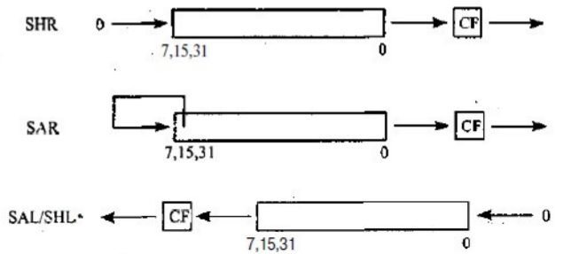

### ​ **Циклические сдвиги**

`ROR op1, op2` - **циклический сдвиг вправо**

`ROL op1, op2` - **циклический сдвиг влево**

`RCR op1, op2` - **циклический сдвиг вправо через флаг переноса**

`RCL op1, op2` - **циклический сдвиг влево через флаг переноса**

Эти команды осуществляют циклический сдвиг приемника (регистр или переменная) на число битов, указанное в счетчике (число или регистр CL, из которого учитываются только младшие 5 бит, принимающие значения от 0 до 31). При выполнении циклического сдвига на один команды ROR (ROL) перемещают каждый бит приемника вправо (влево) на одну позицию, за исключением самого младшего (старшего), который записывается в позицию самого старшего (младшего) бита. Команды ,RCR и RCL выполняют аналогичное действие, но включают флаг CF в цикл, как если бы он был дополнительным битом в приемнике.После выполнения команд циклического сдвига флаг CF всегда равен последнему вышедшему за пределы приемника биту, флаг OF определен только для сдвигов на 1 - он устанавливается, если изменилось значение самого старшего бита, и сбрасывается в противном случае. Флаги SF, ZF, AF и PF не изменяются.

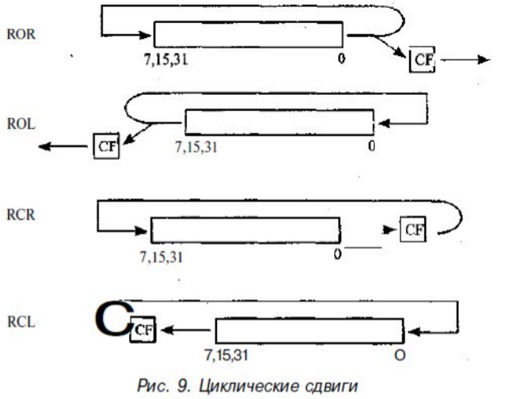

## ​Синтаксис описания процедур. Инструкции CALL и RET.

```asm
ИмяПроцедуры PROC Параметры
    Тело
ИмяПроцедуры ENDP
```

Для описания последовательности команд в виде процедуры в языке ассемблера используются две директивы: PROC и ENDP.

Последвательность вызова процедуры проста: передать параметры, передать управление на начало процедуры (`CALL <PROC_NAME>`) и по её окончании вернуться в место её вызова и продолжить выполнение программы (`RET`).

Процедура может размещаться в любом месте программы, но так, чтобы на нее случайным образом не попало управление. Если процедуру просто вставить в общий поток команд, то микропроцессор будет воспринимать команды процедуры как часть этого потока. Учитывая это обстоятельство, есть следующие варианты размещения процедуры в

программе:

- в начале программы (до первой исполняемой команды);
- в конце (после команды, возвращающей управление операционной системе);
- промежуточный вариант — тело процедуры располагается внутри другой процедуры или основной программы;
- в другом модуле.

Размещение процедуры в начале сегмента кода предполагает, что последовательность команд, ограниченная парой директив PROC и ENDP, будет размещена до метки, обозначающей первую команду, с которой начинается выполнение программы. Эта метка должна быть указана как параметр директивы END, обозначающей конец программы:

```asm
.code
myproc proc near
ret
myproc endp
start proc
call myproc
...
start endp
end start
```

В этом фрагменте после загрузки программы в память управление будет передано первой команде процедуры с именем start. Объявление имени процедуры в программе равнозначно объявлению метки, поэтому директиву `PROC` в частном случае можно рассматривать как форму определения метки в программе. Размещение процедуры в конце программы предполагает, что последовательность команд, ограниченная директивами `PROC` и `ENDP`, будет размещена после команды, возвращающей управление операционной системе.

```asm
.code
start proc
call myproc
...
start endp
myproc proc near
ret
myproc endp
```

Промежуточный вариант расположения тела процедуры предполагает ее размещение внутри другой процедуры или основной программы. В этом случае требуется предусмотреть обход тела процедуры, ограниченного директивами PROC и ENDP, с помощью команды безусловного перехода jmp:

```asm
.code
start proc
jmp ml
myproc proc near
ret
myproc endp
ml:
...
start endp
end start
```

Последний вариант расположения описаний процедур — в отдельном модуле — предполагает, что часто используемые процедуры выносятся в отдельный файл.

Поскольку имя процедуры обладает теми же атрибутами, что и метка в команде перехода, то обратиться к процедуре можно с помощью любой команды условного или безусловного перехода. Но благодаря специальному механизму вызова процедур можно сохранить информацию о контексте программы в точке вызова процедуры. Под контекстом понимается информация о состоянии программы в точке вызова процедуры. В системе команд микропроцессора есть две команды, осуществляющие работу с контекстом. Это команды `call` и `ret`:

- `CALL ИмяПроцедуры` — вызов процедуры (подпрограммы).
- `RET [число]` — возврат управления вызывающей программе.
  - **число** — необязательный параметр, обозначающий количество байт, удаляемых из стека при возврате из процедуры.

# ​Экзаменационный билет №8

## ​Режимы работы процессора Intel 80386.

В настоящее время микропроцессор с 32-битной Intel-архитектурой может работать в одном из четырех режимов: **реальный** режим, **защищённый** режим, **системный** режим и режим **виртуального 8086**.

**Реальный режим** (Real Mode)

После инициализации (системного сброса) центральный процессор находится в реальном режиме. В реальном режиме центральный процессор работает как очень быстрый i8086 с возможностью использования 32-битных расширений. Механизм адресации, размеры памяти и обработка прерываний микропроцессора 8086 полностью совпадают с аналогичными функциями других микропроцессоров с 32-битной Intel архитектурой в реальном режиме. Реальный режим не поддерживает никакой многозадачности и способен выполнять только одну программу за раз. Это возвращение к тому самому вопросу о том, можно ли прервать выполнение программы в DOS – в реальном DOS так делать было нельзя. Во многих современных операционных системах отдельные программы можно закрывать по желанию, потому что каждая задача является своим отдельным процессом, запечатанным в своей области памяти со своими ресурсами, инкапсулировано. В DOS такой инкапсуляции нет – каждая программа является единственной выполняющейся и имеет полную власть над системой, поэтому хоть программу и можно завершить посреди её выполнения, это оставит систему в очень неопределенном состоянии, в котором следующая программа наиболее вероятно вылетит с ошибкой/крашнется/всё равно заставит перезапускать систему. Именно поэтому и нужно прерывание на завершение программы, потому что это выполняет все необходимые действия перед её завершением и позволяет запускать следующую, в то время как убийство процесса не приведет ни к чему хорошему, разве что краш DOSBox или даже самой системы DOS.

**Режим системного управления** (System Management Mode).

В новых поколениях микропроцессоров Intel, начиная с 80386 появился режим системного управления. Он предназначен для выполнения некоторых действий с возможностью их полной изоляции от прикладного программного обеспечения и даже от операционной системы: приостанавливается выполнение любого другого кода и запускается специальная программа-обработчик. В 80386 режим работал только на специальных процессорах, но позже был полностью внедрен в 80486 и Pentium, и все более современные процессоры его поддерживают. Микропроцессор переходит в этот режим только аппаратно с помощью прерываний SMI, которые не могут быть вызваны программно; к примеру, по сигналу от чипсета или периферии, Микропроцессор возвращается из режима системного управления в тот режим, при работе в котором был получен соответствующий сигнал по команде RSM. Эта команда работает только в режиме системного управления и в других режимах не распознается, генерируя исключение #6 (недействительный код операции). Среди возможных применений SMM: Обработка системных ошибок, таких как ошибки памяти и чипсета; Функции защиты, например выключение процессоров при сильном перегреве; Глубокие уровни энергосбережения; Управление питанием — например, схемами изменения напряжения; Эмуляция периферии, которая не была реализована на материнской плате или

реализация которой содержит ошибки; Эмуляция мыши и клавиатуры PS/2 при использовании таких же устройств с интерфейсом USB; Централизованная конфигурация системы, например на ноутбуках Toshiba и IBM; Обход систем защиты, встроенных в ОС; Запуск высокопривилегированных руткитов, как было предложено на Black Hat;

**Защищенный режим** (Protected Mode)

Защищенный режим является основным режимом работы микропроцессора. Ключевые особенности защищенного режима: виртуальное адресное пространство, защита и многозадачность. В защищенном режиме программа оперирует с адресами, которые могут относиться к физически отсутствующим ячейкам памяти, поэтому такое адресное пространство называется виртуальным. Размер виртуального адресного пространства программы может превышать емкость физической памяти и достигать 64Тбайт.

**Виртуальный режим** i8086 (V86)

В режим V86 процессор может перейти из защищённого режима, если установить в регистре флагов бит виртуального режима. Когда процессор находится в виртуальном режиме, его поведение во многом напоминает поведение процессора i8086. В частности, для адресации памяти используется схема \<сегмент:смещение\>, размер сегмента составляет 64 килобайта, а размер адресуемой в этом режиме памяти - 1 мегабайт. Виртуальный режим предназначен для работы программ, ориентированных на процессор i8086 (или i8088). Но виртуальный режим – это не реальный режим процессора i8086, имеются существенные отличия. Процессор фактически продолжает использовать схему преобразования адресов памяти и средства мультизадачности защищённого режима. В виртуальном режиме используется трансляция страниц памяти. Это позволяет в мультизадачной операционной системе создавать несколько задач, работающих в виртуальном режиме. Каждая из этих задач может иметь собственное адресное пространство, каждое размером в 1 мегабайт. Все задачи виртуального режима обычно выполняются в третьем, наименее привилегированном кольце защиты. Когда в такой задаче возникает прерывание, процессор автоматически переключается из виртуального режима в защищённый. Поэтому все прерывания отображаются в операционную систему, работающую в защищённом режиме. Обработчики прерываний защищённого режима могут моделировать функции соответствующих прерываний реального режима, что необходимо для правильной работы программ, ориентированных на реальный режим операционной системы MS-DOS.

## ​Арифметика повышенной точности. Опишите процедуру сложения и вычитания двух 32-битных чисел, находящихся в парах 16-битных регистров.

Пара команд ADD/ADC используется для сложения чисел повышенной точности. Сложим, например, два 32-битных целых числа. Пусть одно из них находится в паре регистров DX:АХ (младшее слово (биты 0-15) - в АХ и старшее (биты 16-31) - в DX), а другое — в паре регистров ВХ:СХ:

```asm
add ax, cx
adc dx, bx
```

Если при сложении младших двойных слов произошел перенос из старшего разряда (флаг CF = 1), то он будет учтен следующей командой ADC (ADC — сложение, учитывающее флаг переноса).

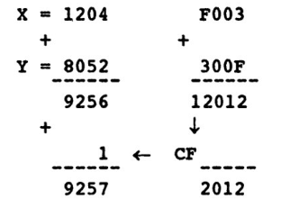

SBB можно использовать для вычитания 32-битных чисел в DX:AX и ВХ:СХ

аналогично ADD/ADC:

```asm
sub ax, cx
sbb dx, bx
```

Если при вычитании младших двойных слов произошел заем, то он будет учтен при вычитании старших слов.

## ​Прерывания в реальном и защищённом режимах работы процессора Intel.

*лекция 11 стр 2*

В IBM PC-совместимых компьютерах обработку некоторых прерываний осуществляют подпрограммы BIOS. Также обслуживание прерываний могут взять на себя BIOS сетевых карт или видеокарт, операционная система и даже обычные (прикладные) программы, которые постоянно находятся в памяти во время работы других программ (т. н. резидентные программы). **В отличие от реального режима, в защищённом режиме x86-процессоров обычные программы не могут обслуживать прерывания, эта функция доступна только системному коду (операционной системе)**.

В реальном режиме база IDTR = 00000h, а лимит - 3FFh (размер 400h байт минус единица). По адресу 00000 находится так называемая таблица векторов прерываний (Interrupt Vector Table), состоящая из 256 векторов. Каждый вектор содержит смещение и сегмент своего обработчика. Обе компоненты занимают 2 байта, таким образом общий размер таблицы составляет 256*2*2 = 1024 = 400h байт.

В защищенном режиме дело обстоит совершенно по-другому. IDTR должен указывать на так называемую дескрипторную таблицу прерываний (Interrupt Descriptor Table, IDT), состоящую из 8-байтных дескрипторов для каждого прерывания, которая может содержать шлюзы задачи, прерывания и ловушки. 

# ​Экзаменационный билет №9

## ​Арифметические инструкции в ассемблере.

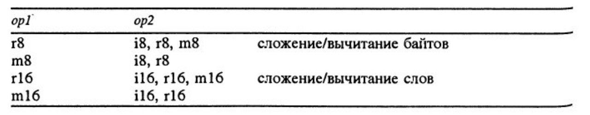

### ​add op1, op2 - **сложение**

Команда выполняет арифметическое сложение приемника и источника, помещает сумму в приемник, не изменяя содержимое источника. Приемник может быть регистром или переменной, источник - числом, регистром или переменной, но нельзя использовать переменную одновременно и для источника, и для приемника. Команда ADD никак не различает числа со знаком и без знака, но, употребляя значения флагов CF (перенос при сложении чисел без знака), OF (перенос при сложении чисел со знаком) и SF (знак результата), разрешается применять ее и для тех, и для других.

### ​sub op1, op2 - **вычитание**

Вычитает источник из приемника и помещает разность в приемник. Приемник может быть регистром или переменной, источник - числом, регистром или переменной, но нельзя использовать переменную одновременно и для источника, и для приемника. Точно так же, как и команда ADD,

SUB не делает различий между числами со знаком и без знака, но флаги позволяют использовать её и для тех, и для других.

### ​inc op1[r8, m8, r16, m16] — **инкремент**

Увеличивает приемник (регистр или переменная) на 1. Единственное отличие этой команды от ADD приемник,1 состоит в том, что флаг CF не затрагивается. Остальные арифметические флаги (OF, SF, ZF, AF, PF) устанавливаются в соответствии с результатом сложения.

### ​dec op1[r8, m8, r16, m16] — **декремент**

Уменьшает приемник (регистр или переменная) на 1. Единственное отличие этой команды от SUB приемник,1 заключается в том, что флаг CF не затрагивается. Остальные арифметические флаги (OF, SF, ZF, AF, PF) устанавливаются в соответствии с результатом вычитания.

### ​NEG OP

Команда рассматривает свой операнд как число со знаком и **изменяет его знак**. Выполняет над числом, содержащимся в приемнике (регистр или переменная), операцию дополнения до двух. Эта операция эквивалентна обращению знака операнда, если рассматривать его как число со знаком. Если приемник равен нулю, флаг CF устанавливается в 0, иначе - в 1. Остальные флаги (OF, SF, ZF, AF, PF) назначаются в соответствии с результатом операции.

```asm
Mov ah, 1
NEG AH     ;AH = -1 (0xFF)
```

Есть особый случай: если op = -128 и находится в байтовом типе данных, то операнд не меняется, так как в байте нет числа 128. Аналогично и с другими типами. В этом случае, установится флаг OF (в других случаях OF сбрасывается).

Красивый пример использования команды NEG - получение абсолютного значения числа, применяя всего две команды - изменение знака и переход на первую команду еще раз, если знак отрицательный:

```asm
label0: neg eax
        js label0
```

### ​ **Сложение/вычитание с учётом переноса/заёма**.

Допустимые типы операндов как и при ADD/SUB. ADC аналогична ADD, только к сумме операндов ещё прибавляется значение флага CF. OP1 = op1+op2+CF. А в команде разности SBB вычитается ещё 1. Op1 = op1-op2 – CF.

### ​Умножение

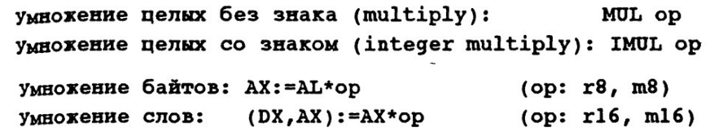

**MUL**: Выполняет умножение содержимого источника (регистр или переменная) и регистра AL, АХ (в зависимости от размера источника) и помещает результат в АХ, DX:AX соответственно. Если старшая половина результата (АН, DX) содержит только нули (результат целиком поместился в младшую половину), флаги CF и OF устанавливаются в 0, иначе - в 1. Значение остальных флагов (SF, ZF, AF и PF) не определено.

**IMUL** : источник (регистр или переменная) умножается на AL или АХ (в зависимости от размера операнда), и результат располагается в АХ или DX:AX.

Во всех вариантах считается, что результат может занимать в два раза больше места, чем размер источника, поскольку существует вероятность переполнения и потери старших битов результата.

Флаги OF и CF будут равны единице, если это произошло, и нулю, если результат умножения поместился целиком в младшую половину приемника.

Значения флагов SF, ZF, AF и PF после команды IMUL не определены.

Как видно из описания, в качестве операнда не может выступать непосредственный операнд. Первый сомножитель не указывается, так как он должен находиться всегда в регистре ax/al. Результат умножение записывается в регистр ax, если операнд – байт и в dx:ax, если операнд – слово. Старшая часть находится в AH/DX, а младшая в AL/AX.

```asm
N DB 10
...
MOV AL,2
MUL N           ; AX=2*10=20=0014h: AH=00h, AL=14h

MOV AL, 26      ; AX=26*10=260=0104h: AH=01h, AL=04h
MUL N

MOV AX,8
MOV BX,-1.
IMUL BX         ; (DX,AX)=-8=OFFFFFFF8h: DX=OFFFFh, AX=OFFF8h
```

То есть, результат хранится в удвоенном формате. Это не всегда пригождается. Иногда известно, когда результат может быть такого-же размера как его операнд, а иногда нет. Возникает вопрос, когда нужно учитывать старшую часть? Ответ в том, что если результат произведения больше операнда, то CF=OF устанавливаются оба. Иначе сбрасываются.

### ​Деление

**Деление** – как и умножение реализуется в две команды, в зависимости от из «знаковости».

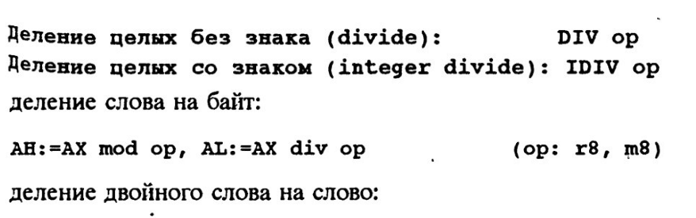

**DIV**: Выполняет целочисленное деление без знака AX или DX:АХ (в зависимости от размера источника) на источник (регистр или переменная) и помещает результат в AL или АХ, а остаток - в АН или DX соответственно. Результат всегда округляется в сторону нуля, абсолютное значение остатка меньше абсолютного значения делителя. Флаги CF, OF, SF, ZF, AF и PF после этой команды не определены, а переполнение или деление на ноль вызывает исключение #DE (ошибка при делении) в защищенном режиме и прерывание О-в реальном.

**IDIV** : Выполняет целочисленное деление со знаком AX или DX:АХ (в зависимости от размера источника) на источник (регистр или переменная) и помещает результат в AL или АХ, а остаток - в АН или DX соответственно. Результат всегда округляется в сторону нуля, знак остатка совпадает со знаком делимого, абсолютное значение остатка меньше абсолютного значения делителя. Флаги CF, OF, SF, ZF, AF и PF после этой команды не определены, а переполнение или деление на ноль вызывает исключение #DE (ошибка при делении) в защищенном режиме и прерывание О-в реальном.

Местонахождение первого операнда (делимого) и результата фиксировано и потому явно не указывается. Указывается только второй операнд (делитель), который может находиться в регистре или в ячейке памяти, но не может быть непосредственным операндом. При делении слова на байт, делимое находится в AX, а делитель должен быть байтом. При делении двойного слова на слово – делитель должен быть в DX:AX. Старшая часть делителя в DX, а младшая в AX. В результате, на место делимого запишется остаток в старшую часть, а в младшую – целая часть. Есть случаи, когда деление невозможно. Это при делении на 0, или, когда результат не помешается в ячейку. Например:

```asm
MOV AX,600
MOV BH,2
DIV BH
```

300 не влезет в AL. В таких ситуациях ПК прекращает выполнение программы.

### ​Логические операции (не знаю, относятся ли они к арифметическим. Но пусть будут)

[см. Логические инструкции](#логические-инструкции-ассемблера-распространенные-способы-их-применения)

### ​Логические и циклические сдвиги (на всякий)

[см. ​Логические сдвиги](#инструкции-арифметического-логического-и-циклического-сдвига-их-применение)

## ​Перечислите макрооператоры в ассемблере и их назначения.

При использовании блоков повторения возникает ряд проблем с записью их формальных и

фактических параметров. Эти проблемы решаются с помощью так называемых макрооператоров – операторов, разрешенных к применению только в конструкциях макроязыка.

### ​Макрооператор &

Рассмотрим пример:

```asm
IRP W,<VAR1,VAR6>
    W DW ?
ENDM
```

Ну никак тут не объяснить, что вместо W нужно подставить фактический параметр, а в DW, вместо второй буквы не надо ничего подставлять! Да и различаются фактические параметры тут только последним символом. Соответственно, лучше бы написать так:

```asm
IRP W,<1,6>
    VARW DW ?
ENDM
```

И тут получается неоднозначность. Для её устранения, непосредственно, перед символом, заменяющим фактические параметры, нужно подставить макрооператор &.

```asm
IRP W,<1,6>
    VAR&W DW ?
ENDM
```

Оттранслируется так:

```asm
VAR1 DW ?
VAR6 DW ?
```

Можно использовать в комбинации с директивой REPT, чтобы задать некоторое число переменных и дать каждой из них уникальное имя. Например:

```asm
value=0
REPT 4
    list&value db value
    value=value+1
endm
```

Это оттранслируется в

```asm
list0 db 0
list1 db 1
list2 db 2
list3 db 3
```

По сути, этот макрооператор нужен для того, чтобы параметр, переданный в качестве операнда макроопределению или блоку повторений, заменялся значением до обработки ассемблером. Так, например, следующий макрос выполнит команду PUSH EAX, если его вызвать как PUSHREG А:

```asm
pushreg macro letter
    push e&letter&x
Endm
```

Иногда можно использовать только один амперсанд - в начале параметра, если не возникает неоднозначностей. Например, если передается номер, а требуется создать набор переменных с именами, оканчивающимися этим

номером:

```asm
irp number,<1,2,3,4>
    msg&number db ?
Endm
```

### ​Макрооператор \<\>

Как было сказано, фактические параметра IRP-блока не должны содержать ",\<;\>" , а во втором операнде IRPC-блока нельзя указывать пробелы и точки с запятой. Эти ограничения связаны с тем, что иначе возможна путаница: например, не понятно сколько вообще параметров есть у макроса. Чтобы можно было их использовать (группировать параметры), нужно их обрамить угловыми скобками.

```asm
IRP VAL,<<1,2>,3>
    DB VAL
ENDM
```

Преобразуется в

```asm
DB 1,2
DB 3
```

Или

```asm
IRPC S,<A;B>
    DB '&S'
ENDM
```

Преобразуется в

```asm
DB 'A'
DB ';'
DB 'B'
```

То есть он действует так, что весь текст, заключенный в эти скобки, рассматривается как текстовая строка, даже если он содержит пробелы или другие разделители. Этот макрооператор используется при передаче текстовых строк в качестве параметров для макросов. Другое частое применение угловых скобок — передача списка параметров вложенному макроопределению или блоку повторений.

### ​Макрооператор !

Является экранирующим символом, который нужно подставить перед служебным (типа точки с запятой или угловой скобки), чтобы он означал не своё служебное значение, а часть параметра. Например:

```asm
IRP X, <A!>B,Hello world!>
    DB '&X'
ENDM
```

Оттранслируется в

```asm
DB 'A>B'
DB 'Hello world!'
```

Используется аналогично угловым скобкам, но действует только на один следующий символ, так что, если этот символ - запятая или угловая скобка, он все равно будет передан макросу как часть параметра.

### ​Макрооператор %

В макроязыке есть ещё один макрооператор, используемый при записи фактических параметров IRP-блоков (и макросов)

% **константное\_выражение** - вычисляет значение этого самого константного выражения. Здесь вложенность не допускается. Указывает, что находящийся за ним текст является выражением и должен быть вычислен. Обычно это требуется для того, чтобы передавать в качестве параметра в макрос не само выражение, а его результат.

```asm
K EQU 4
IRP A,<K+1,%K+1,W%K+1>
    DW A
ENDM
```

&darr;

```asm
DW K+1
DW 5
DW W5
```

### ​Макрооператор ;;

Если в теле блока повторения (и макроса) имеются комментарии, то они переносятся во все копии блока. Однако бывает так, что комментарий полезен при описании самого блока повторения, но не нужен в его копиях. В таком случае, следует начинать комментарий не с одной точки с запятой, а с двух. В отличие от обычных комментариев текст макрокомментария не попадает в листинг и в текст программы при подстановке макроса. Это сэкономит память при ассемблировании программы с большим количеством макроопределений.

```asm
IRP R,<AX,BX>
      ;;восстановление регистров
POP R ;восстановить R
      ;;стек -> R
ENDM
```

Приведётся в:

```asm
POP AX ;восстановить AX
POP BX ;восстановить BX
```

## Регистры GDTR/LDTR. Чем селектор защищенного режима отличается от адреса сегмента реального?

**ВАЖНО** прочесть лекцию 8

### Глобальная таблица дескрипторов (GDT):

Начало таблицы GDT храниться в регистре GDTR. Регистр GDTR – это самый обыкновенный регистр, такой же обыкновенный, как EAX, EIP, ES, только вот его функция заключается не в хранении каких-то промежуточных данных, а в хранении фиксированного числа – начала таблицы GDT. Называние регистра GDTR запомнить очень легко: GDT – это таблица, R – регистр, в итоге получаем **global descriptor table register**.

Адрес начала таблицы GDT в памяти должен быть кратен 8. Это связано с архитектурой, так процессор быстрее работает при обращении к таблице.

### GDTR:

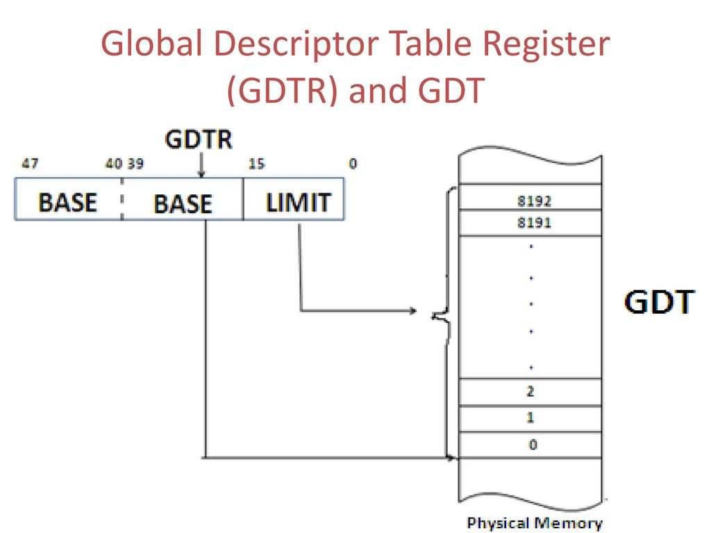

32-битный линейный базовый адрес|16-битный лимит таблицы

Вот он, регистр GDTR. Весит 48 бит. Он содержит не только адрес начала таблицы GDT в памяти, а еще и ее лимит. Лимит таблицы – 16-битное значение, показывает величину таблицы в байтах + 1. (т.е. все как и в случае с лимитом сегмента: если лимит таблицы в GDTR равен 0, то на самом деле это означает что реально (в памяти) лимит равен одному байту).

Сегментный дескриптор всегда занимает 8 байт (2 двойных слова). Следовательно, лимит таблицы дескрипторов – величина, равная 8N-1 байт. Первый дескриптор в GDT не используется и называется «нулевой дескриптор» (null descriptor). При обращении к памяти через этот дескриптор возникает уже знакомое исключение #GP, general protection. Поэтому первый дескриптор в GDT трогать нельзя.

Загрузить/считать значение регистра GDTR можно командами `LGDT/SGDT`. По умолчанию (т.е. после нажатия на кнопку Reset или включения компьютера) база GDT равна нулю, а лимит – FFFFh, т.е. фактически по умолчанию выделено максимум места, под FFFFh/8 = 8191 дескрипторов (минус один, учитывая null descriptor).

### Локальная таблица дескрипторов (LDT):

В отличии от GDT совершенно не обязана присутствовать вообще. И в то же самое время, по желанию, их можно развести великое множество (GDT должна быть только одна). Каждая задача может иметь свою собственную LDT, в то же время несколько задач могут использовать одну LDT на всех. LDT – это сегмент (GDT – структура данных). Это принципиально, потому что так как LDT – это сегмент, то значит у нее тоже есть свой дескриптор в той же глобальной таблице дескрипторов. Так же, как и у GDT, у LDT тоже есть свой регистр – LDTR. В отличии от GDTR этот регистр, помимо инфы про базу и лимит LDT, содержит еще одно поле – сегментный селектор.

#### LDTR

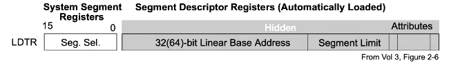

Сегм. Селектор (16 бит)|32-битный линейный базовый адрес|16-битный лимит сегмента Инструкции LLDT и SLDT позволяют писать/читать регистр LDTR. Точно так же, при reset-е значение базы в LDTR падает в ноль, а лимит – в FFFFh.

---

Итак, сначала мы узнали, что программа состоит из сегментов и все они расположены в памяти. Каждый сегмент описывает специальная структура – дескриптор. Дескриптор хранится в специальной
таблице. Найти в памяти таблицу можно по специальному регистру (GDTR, LDTR). Двигаемся дальше.

### Селектор

Пока у нас никак не были задействованы сегментные регистры. Мы все это время спускаемся вниз по ступенькам:

сегмент в памяти &larr; дескриптор &larr; таблица дескрипторов ...

Следующей ступенью будет **селектор**. Это 16-битная структура данных, которая является **идентификатором сегмента**. Селектор указывает не на сам сегмент в памяти, а на его дескриптор, в
таблице дескрипторов. Селектор как раз в сегментном регистре и находится (CS, DS…). Выглядит так:

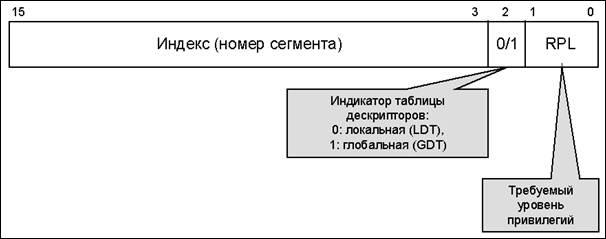

Поле индекс (биты 3-15): указывает на один из 8192 дескрипторов в таблице дескрипторов (GDT или LDT). Почему 8192? Это наибольшее число, которое поместится в 13 битах. (2^13). 

Процессор сам умножает значение поля индекс на 8 (адрес таблицы дескрипторов **всегда** кратен 8) и добавляет к полученному значению [адрес базы](#адрес-базы) таблицы. То есть процессор умножит то, что находится в поле «индекс», на 8, а потом прибавит значение регистра таблицы – и мы благополучно указываем на начало дескриптора.

Как же узнать, из какой именно таблицы дескриптор? Для этого нужен флаг TI (table indicator) (второй бит). Если он = 0, то прибавится значение регистра GDTR (т.е. дескриптор расположен в таблице GDT), если же установлен – LDTR.

Допустим, мы кладем в DS число 0000000000110 0 00b. Что это значит? Сразу разбиваем DS на кусочки (15-3 биты – индекс, 2 – TI, 1-0 – приивлегии). Индекс равен 6. Значит, шестой по счету дескриптор. А где? В GDT (TI=0).

А учитывается ли нулевой дескриптор (null descriptor) при «счете»?
Обязательно. Более того, мы даже можем положить в сегментный регистр (DS, SS…) селектор с полями индекс и TI равными 0. То есть, фактически мы выбираем нулевой дескриптор в таблице GDT.
Это возможно, и ничего страшного не произойдет до тех пор, пока мы не обратимся к памяти, используя такой сегментный регистр. А так он может пролежать там сколько угодно времени, но как только мы обратимся к памяти используя такой регистр (с индексом = 0) – мгновенное исключение #GP, general protection.

#### Отличия селектора защищенного режима от адреса сегмента реального 

В архитектуре процессоров Intel существуют ШЕСТЬ сегментных регистров:
CS, DS, SS, ES, GS и FS. Каждый из этих регистров отвечает за свой сегмент в памяти (кода, данных или стека). Итак, даже если программа состоит из тысячи сегментов, только 6 из них могут быть доступны в данный момент времени. Другие сегменты станут доступны только после загрузки
соответствующих селекторов в сегментные регистры. 

В реальном режиме линейные адреса формировались просто: значение сегментного регистра умножалось на 10h и прибавлялось смещение. То есть никакого селектора явно не существовало, никаких дескрипторов, только сегментный регистр и смещение. В защищенном же режиме нужно пройти несколько шагов (селектор-дескриптор- база...) чтобы докопаться до линейного адреса...

Итак, в защищенном режиме сегментный регистр - это 16-битный регистр, содержащий информацию о дескрипторе (а именно - местоположении) и запрашиваемом уровне привилегий. Здесь сразу же возникает вопрос: неужели же процессор при каждом обращении к памяти все время повторяет одни
и те же действия (ищет дескриптор, потом ищет базу, затем прибавляет к базе смещение...), и так при выполнении фактически каждой команды. На самом деле сегментный регистр - это 80-битный регистр, нам же доступны только младшие 16 бит, которые и называются селектором.

Остальные 64 бита называются "Теневым регистром" (Shadow register) или "Дескрипторным кэшем" (Descriptor cache), они и содержит ту самую базу, которую процессор по идее должен был бы высчитывать на каждом шаге. Кроме базы этот самый "теневой регистр" содержит еще и лимит, и права доступа. Еще раз: как только мы загружаем в видимую часть (в селектор) соответствующее значение, процессор сразу же по селектору (а конкретно - по полю индекс) выпасает базу, лимит и права доступа из дескриптора и
заносит их в "теневую часть" сегментного регистра, тем самым облегчая себе жизнь в дальнейшем.

Если мы вдруг решим неожиданно поменять значение базы в дескрипторе для какого-либо сегмента, селектор которого в данный момент уже находится в сегментном регистре, то мы также должны позаботиться и о перезагрузке сегментного регистра, т.к. в теневой части останутся старые значения базы и лимита, и фактически процессору абсолютно наплевать на то, что творится в таблицедескрипторов, он руководствуется только текущим значением базы и лимита в теневой части. Таким образом, если в дескрипторе были изменены база или лимит, сегментный регистр нужно перезагрузить.

Загрузить сегментные регистры (явно или неявно) позволяют следующие команды:

ЯВНО:

```asm
MOV
POP - значение из стека
LDS - загрузить DS
LES - загрузить ES
LSS - загрузить SS
LGS - загурзить GS
LFS - загрузить FS
```

НЕЯВНО:

```asm
CALL, JMP, RET и другие.
``` 
Чаще всего "неявные" команды изменяют значение именно CS-регистра, но в некоторых случаях и других.

В реальном режиме архитектура процессора никуда не девается, при загрузке селектора в сегментный регистр процессор сам создает соответствующий дескриптор в его скрытой части. Он описывает 16-
битный сегмент, начинающийся по указанному адресу с границей 64 Кб.

# ​Экзаменационный билет №10

## ​Запись идентификаторов, целых чисел, символьных данных, комментариев, команд в языке ассемблера.

### Идентификаторы
Понятие идентификатора в языке ассемблера ничем не отличается от понятия идентификатора в других языках. Можно использовать латинские буквы, цифры и знаки `_ . ? @ $`, причём точка может быть только первым символом идентификатора. Большие и маленькие буквы считаются эквивалентными.

### Целые числа
В программе на языке ассемблера целые числа могут быть записаны в двоичной, восьмеричной, десятичной и шестнадцатеричной системах счисления. Для задания системы счисления в конце числа ставится буква b, o/q, d или h соответственно. Шестнадцатеричные числа, которые начинаются с «буквенной» цифры, должны предваряться нулём, иначе компилятор не сможет отличить число от идентификатора

### Символьные данные
Символы и строки в языке ассемблера могут заключаться в
апострофы или двойные кавычки. Если в качестве символа или
внутри строки надо указать апостроф или кавычку, то делается
это следующим образом: если символ или строка заключены в
апострофы, то апостроф надо удваивать, а кавычку удваивать не
надо, и наоборот, если символ или строка заключены в двойные
кавычки, то надо удваивать кавычку и не надо удваивать
апостроф. Все следующие примеры корректны и эквивалентны:
'don''t', 'don"t', "don't", "don""t".

### Комментарии
Комментарии в языке ассемблера начинаются с символа
«точка с запятой» и могут начинаться как в начале строки, так и
после команды.

### Команды
Команды языка ассемблера – это символьная форма записи
машинных команд. Команды имеют следующий синтаксис:

```asm
[<метка>:] <мнемокод> [<операнды>] [;<комментарий>]
```

**Метка** – это имя. Метка обязательно должна отделяться
двоеточием, но может размещаться отдельно, в строке,
предшествующей остальной части команды.

Метки нужны для ссылок на команды из других мест,
например, в командах перехода. Компилятор языка ассемблера
заменяет метки адресами команд.

**Мнемокод** – это служебное слово, указывающее операцию,
которая должна быть выполнена. Язык ассемблера использует не
цифровые коды операций, а мнемокоды, которые легче
запоминаются. Мнемокод является обязательной частью
команды.

**Операнды команды**, если они есть, отделяются друг от друга
запятыми.

### Операнды команд
В качестве операндов команд языка ассемблера могут
использоваться:
* регистры, обращение к которым осуществляется по именам;
* непосредственные операнды – константы, записываемые непосредственно в команде;
* ячейки памяти – в команде записывается адрес нужной
ячейки.

Для задания адреса существуют следующие возможности.

* Имя переменной, по сути, является адресом этой
переменной. Встретив имя переменной в операндах
команды, компилятор понимает, что нужно обратиться к
оперативной памяти по определённому адресу. Обычно
адрес в команде указывается в квадратных скобках, но имя
переменной является исключением и может быть указано
как в квадратных скобках, так и без них. Например, для
обращения к переменной x в команде можно указать x или
[x].
* Если переменная была объявлена как массив, то к элементу
массива можно обратиться, указав имя и смещение. Для
этого существует ряд синтаксических форм, например:
`<имя>[<смещение>]` и `[<имя> + <смещение>]` (см.
раздел 5). Однако следует понимать, что смещение – это
вовсе не индекс элемента массива. Индекс элемента массива
– это его номер, и этот номер не зависит от размера самого
элемента. Смещение же задаётся в байтах, и при задании
смещения программист сам должен учитывать размер
элемента массива.
* Адрес ячейки памяти может храниться в регистре. Для
обращения к памяти по адресу, хранящемуся в регистре, в
команде указывается имя регистра в квадратных скобках,
например: `[ebx]`. Как уже говорилось, в качестве регистров
базы рекомендуется использовать регистры EBX, ESI, EDI и
EBP.
* Адрес может быть вычислен по определённой формуле. Для
этого в квадратных скобках можно указывать достаточно
сложные выражения, например, `[ebx + ecx]` или `[ebx + 4 * ecx]`.

В описаниях команд языка ассемблера для обозначения
возможных операндов используют сокращения, состоящие из
буквы r (для регистров), m (для памяти) или i (для
непосредственного операнда) и числа 8, 16 или 32, указывающего
размер операнда. Например:

* `add r8/r16/r32, r8/r16/r32` ; Сложение регистра с регистром
* `add r8/r16/r32, m8/m16/m32` ; Сложение регистра с ячейкой памяти
* `add r8/r16/r32, i8/i16/i32` ; Сложение регистра с непосредственным операндом
* `add m8/m16/m32, r8/r16/r32` ; Сложение ячейки памяти с регистром
* `add m8/m16/m32, i8/i16/i32` ; Сложение ячейки памяти с непосредственным операндом

Команды языка ассемблера обычно имеют 1 или 2 операнда,
или не имеют операндов вообще. Во многих, хотя не во всех,
случаях операнды (если их два) должны иметь одинаковый
размер. Команды языка ассемблера обычно не работают с двумя
ячейками памяти.

## ​Директивы условного ассемблирования.

Существует два класса условных директив:

- директивы условного ассемблирования
- условные директивы генерации сообщений об ошибке.

В большинстве языков программирования присутствуют средства, позволяющие игнорировать тот или иной участок программы в зависимости от выполнения условий, например: в языке С это осуществляется директивами препроцессора #if, #ifdef, #ifndef и т. д. Ассемблер тоже предоставляет такую возможность.

**Основные классы директив** – IF, ELSEIF и ERR.

**Условное ассемблирование** : IF, IFE, IFIDN, IFDIF, IFB, IFNB.

```asm
<IF-директива>
    <фрагмент-1>
ELSE
    <фрагмент-2>
ENDIF
```

Или

```asm
<IF-директива>
    <фрагмент-1>
ENDIF
```

Каждая директива условного ассемблирования **IFxxx** задает конкретное условие, при

вычислении которого получается истинное (true) или ложное (false) значение. Если условие имеет значение true, то выполняется ассемблирование и помещение в объектный файл блока

ассемблируемого кода "тело\_условия\_true". Если при вычислении условия получается значение false, то Турбо Ассемблер пропускает "тело\_условия\_true" и не включает его в объектный файл. При наличие директивы **ELSE** , если условие имеет значение false, то ассемблируется и выводится в объектный файл блок "тело\_условия\_false". Если условие имеет значение true, то этот блок игнорируется. Условный блок завершается директивой **ENDIF**.

Два описанных блока кода являются взаимноисключающими: в объектный файл включается

либо "тело\_условия\_true", либо "тело\_условия\_false", но не оба блока одновременно. Кроме того, если вы используете форму IFxxx.ELSE.ENDIF, один из блоков будет обязательно включаться в объектный файл. Если используется форма IFxxx.ENDIF, то "тело\_условия\_true" может включаться или не включаться в объектный файл, в зависимости от условия.

При использовании вложенных директив IF и ELSE директива ELSE всегда соответствует

ближайшей директиве IF.

Вы можете использовать директивы условного ассемблирования ELSEIFxxx как сокращенную форму, когда требуется использовать несколько директив IF. Директива ELSEIFxxx представляет собой эквивалент директивы ELSE, за которой следует вложенная директива IFxxx, но дает более компактный код. Например:

```asm
IF mode EQ 0
    ...
ELSEIF mode LT 5
    ...
ELSE
    ...
ENDIF
```

сравните его со следующим:

```asm
IF mode EQ 0
    ...
ELSE
    IF mode LT 5
    ...
    ELSE
    ...
    ENDIF
ENDIF
```

Вне оператора IFxxx директиву ELSEIFxxx использовать нельзя.

Кроме общих директив IF и ELSEIF ассемблеры поддерживают набор специальных команд, каждая из которых проверяет специальное условие:

### ​IF, IFE

```asm
IF  <константное выражение>  ; <константное выражение> != 0
IFE <константное выражение>  ; <константное выражение> == 0
```

Т.е. IFE/ELSEIFE проверяют, если выражение ложно (равно нулю), в отличие от IF, который проверяет его истинность.

**Соответствующие директивы ошибок – ERRIF, ERRIFE.**

### ​IFIDN, IFDIF (сравниваются тексты в параметрах)

Эти и следующие директивы применяются в макроопределениях для проверки параметров.

IFIDN \<t1\>, \<t2\>

IFDIF \<t1\>, \<t2\>

t1, t2 – любые тексты

```asm
IFIDN <a+b>, <a+b>   ; true
IFIDN <a+b>, <a>     ; false
IFIDN <a+b>, <a+B>   ; false
```

* IFDIF \<arg1\>,\<arg2\>/ELSEIFDIF \<arg1\>,\<arg2\> - если аргументы отличаются (с различием больших и маленьких букв);

* IFDIFI \<arg1\>,\<arg2\>/ELSEIFDIFI \<arg1\>,\<arg2\> - если аргументы отличаются (без различия больших и маленьких букв);

* IFIDN \<arg1\>,\<arg2\>/ELSEIFIDN \<arg1\>,\<arg2\> - если аргументы одинаковы (с различием больших и маленьких букв);

* IFIDNI \<arg1\>,\<arg2\>/ELSEIFIDNI \<arg1\>,\<arg2\> - если аргументы одинаковы (без различия больших и маленьких букв).

Тексты должны обязательно быть заключены в «уголки»

```asm
MM MACRO R1,R2,T
    LOCAL L
    IFDIF <R1>,<R2>     ;; R1 и R2 - разные регистры?
        CMP R1, R2      
    IFIDN <T>,<MAX>     ;; T=MAX?
        JGE L           ;; да
    ELSE
        JLE L           ;; нет
    ENDIF
    MOV R1,R2
L:  
    ENDIF
ENDM
```

### ​IFB, IFNB (проверка параметра на пустоту)

IFB \<t\>

IFNB \<t\>

```asm
DEF MACRO X,V
    IFB <V>     ;;параметр V задан пустой?
        X DB ?
    ELSE
        X DB V
    ENDIF
ENDM
```

* IFB \<аргумент\>/ЕLSEIFB \<аргумент\> - если значение аргумента - пробел;

* IFNB \<aргумент\>/ELSEIFNB \<аргумент\> - если значение аргумента - не пробел;

* IFDEF, IFNDEF – определен ли идентификатор.

* IFDEF метка/ELSEIFDEF метка - если метка определена;

* IFNDEF метка/ELSEIFNDEF метка - если метка не определена;

Директивы условного ассемблирования эффективно используются в макросах. Например: напишем макрос, выполняющий умножение регистра АХ на число, причем, если множитель - степень двойки, то умножение будет выполняться более быстрой командой сдвига влево.

```asm
fast_mul macro number
    if number eq 2
        shl ax, 1
    elseif number eq 4
        shl ax, 2
    elseif number eq 8
        shl ax, 3
    ...
    elseif number eq 32768
        shl ax, 15
    else
        mov dx, number
        mul dx
    endif
endm
```

Этот макрос можно усложнить, применяя различные команды и их комбинации, но в нынешнем виде он чрезмерно громоздкий. Проблема решается с помощью блоков повторений.

### ​Директивы условной генерации ошибок

Директивы условного ассемблирования позволяют вам генерировать во время ассемблирования сообщения об ошибках при наступлении определенных событий. Ассемблер выводит сообщение об на экран и в файл листинга и предотвращает создание объектного файла. То есть, иногда директивы условного ассемблирования используются для того, чтобы прервать ассемблирование программы, если обнаружилась какая-нибудь ошибка. Для таких случаев предназначены директивы условной генерации ошибок.

**Директива ERRxxx** генерирует при удовлетворении определенных условий сообщения пользователя об ошибке. Она имеет следующий общий синтаксис:

`ERRxxx [аргументы] [сообщение]`

В этом случае директива ERRxxx представляет какую-либо из директив условной генерации сообщения об ошибке (такие как ERRIFB и т.д.).

"Аргументы" представляют аргументы, которые могут потребоваться в директиве для вычисления условия. Некоторые директивы требуют выражения, другие требуют символьного выражения, а некоторые - одно или два текстовых выражений. Некоторые из директив вовсе не требуют аргументов.

Если указано "сообщение", то оно задает необязательное сообщение, которое выводится с ошибкой. Сообщение должно быть заключено в кавычки (' или ").

Директивы генерации сообщений об ошибке генерируют пользовательское сообщение об ошибке, которое выводится на экран и включается в файл листинга (если он имеется) в месте расположения директивы в исходном коде. Если директива задает сообщение, оно выводится на той же строке непосредственно за ошибкой. Например, директива:

ERRIFNDEF foo "foo не определено!"

если идентификатор foo не определен при обнаружении ошибки, приведет к генерации ошибки:

User error: "foo не определено!"

Аналогично командам условного ассемблирования, существуют модификации команды ERR (см. **Безусловные директивы генерации сообщений** ):

- ERRE выражение - ошибка, если выражение равно нулю (ложно);
- ERRNZ выражение - ошибка, если выражение не равно нулю (истинно);
- ERRDEF метка - ошибка, если метка определена;
- ERRNDEF метка - ошибка, если метка не определена;
- ERRB \<аргумент\> - ошибка, если аргумент пуст;
- ERRNB \<аргумент\> - ошибка, если аргумент не пуст;
- ERRDIF \<arg1\>,\<arg2\> - ошибка, если аргументы различны;
- ERRDIFI \<arg1\>,\<arg2\> - ошибка, если аргументы отличаются (сравнение не различает большие и маленькие буквы);
- ERRIDN \<arg1\>,\<arg2\> - ошибка, если аргументы совпадают;
- ERRIDNI \<arg1\>,\<arg2\> - ошибка, если аргументы совпадают (сравнение не различает большие и маленькие буквы).

### ​Безусловные директивы генерации сообщений

Безусловными директивами генерации сообщений об ошибке являются директивы ERR. Эти директивы всегда генерируют ошибку и не требуют аргументов, хотя могут содержать необязательное сообщение.

## ​Прерывания: определение, обработка, роль регистра IDTR.

### Определение, обработка, типы

Прерывание — одна из базовых концепций вычислительной техники, которая заключается в том, что при наступлении какого-либо события происходит передача управления специальной процедуре, называемой обработчиком прерываний (ISR, англ. Interrupt Service Routine). В отличие от условных и безусловных переходов, прерывание может быть вызвано в любом месте программы, в том числе если выполнение программы приостановлено, и обусловлено обычно внешними по отношению к программе событиями. После выполнения необходимых действий, обработчик прерываний, как правило, возвращает управление прерванной программе.

Как правило, прерывания используются для работы с периферийными устройствами. К примеру, требуется направить запрос на загрузку данных с диска в память, и пока идёт загрузка — производить какие-либо другие операции, либо остановить выполнение до получения прерывания, а после окончания загрузки перейти к обработчику прерывания, который начнёт обработку поступивших данных. С помощью прерываний также может быть реализована многозадачность, отладка программ, эмуляция определённых устройств и т.д.

В зависимости от источника возникновения сигнала прерывания делятся на:
* **асинхронные**, или **внешние** (аппаратные) - события, которые исходят от внешних аппаратных устройств (например, периферийных устройств) и могут произойти в любой произвольный момент: сигнал от таймера, сетевой карты или дискового накопителя, нажатие клавиш клавиатуры, движение мыши. Факт возникновения в системе такого прерывания трактуется как запрос на прерывание (англ. Interrupt request, IRQ) - устройства сообщают, что они требуют внимания со стороны ОС;
* **синхронные**, или **внутренние** — события в самом процессоре как результат нарушения каких-то условий при исполнении машинного кода: деление на ноль или переполнение стека, обращение к недопустимым адресам памяти или недопустимый код операции;

**программные** (частный случай внутреннего прерывания) — инициируются исполнением специальной инструкции в коде программы. Программные прерывания, как правило, используются для обращения к функциям встроенного программного обеспечения (firmware), драйверов и операционной системы. Термин «ловушка» (англ. trap) иногда используется как синоним термина «прерывание» или «внутреннее прерывание». Как правило, словоупотребление устанавливается в документации производителя конкретной архитектуры процессора.

Внешние прерывания, в зависимости от возможности запрета, делятся на:
* **маскируемые** — прерывания, которые можно запрещать установкой соответствующих битов в регистре маскирования прерываний (в x86-процессорах — сбросом флага **IF** в регистре флагов);
* **немаскируемые** (англ. Non-maskable interrupt, NMI) — обрабатываются всегда, независимо от запретов на другие прерывания. К примеру, такое прерывание может быть вызвано сбоем в микросхеме памяти.

Обработчики прерываний обычно пишутся таким образом, чтобы время их обработки было как можно
меньшим, поскольку во время их работы не могут обрабатываться другие прерывания, а если их будет много (особенно от одного источника), то они могут теряться.

До окончания обработки прерывания обычно устанавливается запрет на обработку этого типа
прерывания, чтобы процессор не входил в цикл обработки одного прерывания. Приоритизация
означает, что все источники прерываний делятся на классы и каждому классу назначается свой
уровень приоритета запроса на прерывание.

Более того, существует два типа обслуживания прерываний, отличающиеся по действиям при поступлении во время обработки прерываний более приоритетных прерываний. 

**Относительное** обслуживание прерываний означает, что если во время обработки прерывания поступает более приоритетное прерывание, то это прерывание будет обработано только после завершения текущей процедуры обработки прерывания.

**Абсолютное** обслуживание прерываний означает, что если во время обработки прерывания поступает более приоритетное прерывание, то текущая процедура обработки прерывания вытесняется, и процессор начинает выполнять обработку вновь поступившего более приоритетного прерывания. После завершения этой процедуры процессор возвращается к выполнению вытесненной процедуры обработки прерывания.

**Вектор прерывания** — закреплённый за устройством номер, который идентифицирует соответствующий обработчик прерываний. Векторы прерываний объединяются в таблицу векторов прерываний, содержащую адреса обработчиков прерываний. Местоположение таблицы зависит от типа и режима работы процессора.

**Программное прерывание** — синхронное прерывание, которое может осуществить программа с помощью специальной инструкции.

В процессорах архитектуры x86 для явного вызова синхронного прерывания имеется инструкция Int, аргументом которой является номер прерывания (от 0 до 255). В IBM PC-совместимых компьютерах обработку некоторых прерываний осуществляют подпрограммы BIOS. Также обслуживание прерываний могут взять на себя BIOS сетевых карт или видеокарт, операционная система и даже обычные (прикладные) программы, которые постоянно находятся в памяти во время работы других программ (т. н. резидентные программы). В отличие от реального режима, в защищённом режиме x86-процессоров обычные программы не могут обслуживать прерывания, эта 
функция доступна только системному коду (операционной системе).

Доступ к основному множеству функций MS-DOS осуществляется исполнением инструкции Int 21h (при этом номер функции и её аргументы передаются в регистрах). Это распределение номеров прерываний не закреплено аппаратно и другие программы могут устанавливать свои обработчики прерываний вместо или поверх уже имеющихся обработчиков, установленных MS-DOS или другими программами, что, как правило, используется для изменения функциональности или расширения списка системных функций.

По сути вызов прерывания программно аналогичен вызову функции командой `call`. Однако некоторые прерывания вызывать программно не стоит, так как это непременно приведет к ошибкам. К таким прерываниям относятся те исключения, при возникновении которых процессор помещает в стек т. н. код ошибки — дополнительная информация о произошедшем исключении. Команда int не помещает в стек код ошибки, но «ничего не подозревающий» обработчик исключения ожидает, что код ошибки будет в стеке — поэтому и произойдет ошибка.

Команду int n могут выполнять как программы, работающие в режиме ядра (наиболее
привилегированном), так и программы, работающие в пользовательском режиме (наименее
привилегированном). Для пользовательских программ вызов программного прерывания — это способ
воспользоваться услугами операционной системы — т. н. системными вызовами.

Более того, при программном вызове обработчика прерывания процессор проверяет, обладает ли вызывающий код достаточным уровнем привилегий для осуществления такого вызова. Каков этот достаточный уровень привилегий, определяет поле DPL дескриптора шлюза прерывания. К примеру, для того, чтобы пользовательский код мог вызвать обработчик прерывания программно, дескриптор шлюза прерывания должен иметь поле DPL=3.

Среди программных прерываний команда int 3 занимает особое место и имеет короткий опкод 0xСС. Эта команда используется отладчиками для реализации точек останова.

### IDTR

Для того, чтобы обрабатывать прерывания, нужно рассмотреть новую сущность – IDT, interrupt descriptor table. И в реальном и в защищенном режиме существует регистр IDTR, в котором процессор хранит адрес и лимит таблицы прерываний.

В реальном режиме база IDTR = 00000h, а лимит - 3FFh (размер 400h байт минус единица). По адресу 00000 находится так называемая таблица векторов прерываний (Interrupt Vector Table), состоящая из 256 векторов. Каждый вектор содержит смещение и сегмент своего обработчика. Обе компоненты занимают 2 байта, таким образом общий размер таблицы составляет 256*2*2 = 1024 = 400h байт.

В защищенном режиме дело обстоит совершенно по-другому. IDTR должен указывать на так называемую дескрипторную таблицу прерываний (Interrupt Descriptor Table, IDT), состоящую из 8-байтных дескрипторов для каждого прерывания, которая может содержать шлюзы задачи, прерывания и ловушки. Мы рассмотрим только шлюз прерывания.

Он описывается следующей структурой:

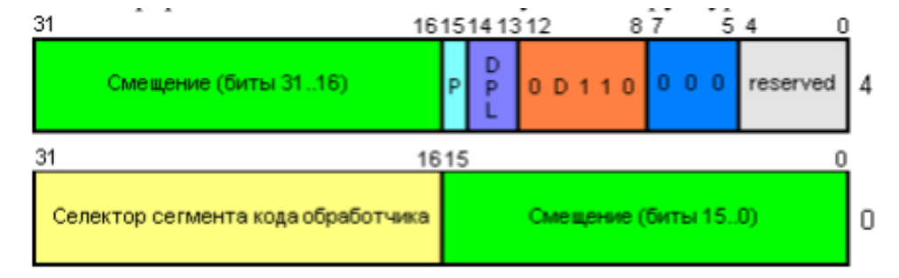

Как нетрудно заметить, его формат напоминает дескриптор из GDT/LDT, но есть некоторые
изменения. Первое и последнее слова дескриптора шлюза прерывания содержат 32-битный адрес
обработчика прерывания (зеленое поле "смещение" на картинке). Второе слово содержит селектор
сегмента кода, где находится код обработчика. Из дескрипторов сегмента унаследованы только
следующие биты:
P (Present) - бит присутствия. Если =1, прерывание обрабатывается, если =0 генерируется исключение общей защиты. DPL (Descriptor Privilege Level) - уровень привилегий, о нем позже. D - разрядность.

При генерации прерывания происходит следующее. Из IDTR извлекается база таблицы дескрипторов прерываний. В этой таблице по номеру прерывания находится дескриптор шлюза прерывания. Если его бит Present сброшен, генерируется исключение общей защиты. Если текущий уровень ривилегий отличается от уровня привилегий обработчика, происходит переключение стека и в стеке обработчика сохраняется указатель на стек прерванной задачи (SS и ESP). В стек помещаются регистры EFLAGS, CS, EIP. Для некоторых исключений последним в стек помещается еще и код ошибки, который, кстати, должен вытолкнуть обработчик исключения после обработки. При вызове обработчика через шлюз прерывания очищается бит IF, блокируя дальнейшие маскируемые аппаратные прерывания. После обработки прерывания обработчик должен вытолкнуть из стека код ошибки, если он там есть, и выполнить инструкцию IRETD (для 32-разрядных операндов, IRET для 16), которая восстанавливает регистр флагов из стека. Если уровень привилегий прерванной задачи не равен уровню привилегий обработчика, выталкиваются регистры SS и ESP (обратное восстановление стека).

При вызове прерывания действуют механизмы защиты - не позволяется передача управления к менее привилегированному коду, если DPL сегмента кода обработчика больше, чем CPL. Для исключений и аппаратных прерываний оно игнорируется

# ​Экзаменационный билет №11

## ​Чем отличается директива присваивания от директивы эквивалентности?

Присваивание:

\<имя\> = \<константное выражение\>

Эквивалентность:

\<имя\> EQU \<операнд\>

в отличие от констант, определённых по директиве EQU, константа, определенная через «=», может менять своё значение обозначая в разных частях текста программы разные числа.

Если с помощью директивы EQU можно определить имя, обозначающее не только число, но и другие конструкции, то по директиве присваивания можно определить только числовую константу. Кроме того, если имя указано в левой части директивы EQU, то оно не может появляться в левой части других директив (его нельзя переопределять). А вот имя, появившееся в левой части директивы присваивания, может снова появиться в начале другой такой директивы (но только такой!).

```asm
K=1
N EQU K
A DW N ;A=1
K=2
B DW N ;B=2
K=1
N EQU K+10
C DW N ;c=11
K=2
D DW N ;d=11
```

Другими словами, при директиве EQU значение слева – синоним значения справа и ассемблер будет подставлять значение справа вместо встретившегося синонима слева. При директиве присваивания, константа слева вычисляется сразу.

## ​Директивы определения данных. Оператор DUP.

**Директива определения данных** :

имя D\* операнд1, …,операндn,

где \* заменяется либо на B (если операнд — байт), либо на W (если операнд — слово)

**DUP**

Если мы хотим описать байтовый массив R из 8 элементов с начальным значением 0 для каждого из них, то это можно сделать так:

```asm
R DB 0,0,0,0,0,0,0,0
```

Но, можно сделать и так:

```asm
R DB 8 DUP(0).
```

Здесь в качестве операнда использована так называемая конструкция повторения, в которой сначала указывается коэффициент повторения, затем – служебное слово **DUP** (**dup**licate), а за ним в круглых скобках – повторяемая величина.

В общем случае эта конструкция имеет следующий вид:

```asm
count dup (p1, p2, p3, …, pn)
```

Где count – константное выражение, count \>= 1, pi – любой допустимый операнд директивы DB

Вложенность конструкций **DUP** можно использовать для описания многомерных массивов.

## ​Схема преобразования виртуального адреса в линейный в защищенном режиме.

*лекция 8 стр 7*

Допустим, нам нужно узнать адрес инструкции в памяти, но о ней не известно ничего, кроме того, что на нее указывает CS:EIP. По сути это логический (то есть некий абстрактный адрес = виртуальный). Как же найти линейный адрес в памяти, руководствуясь только этими двумя значениями: CS и EIP?
Сразу смотрим в CS и ищем в нем поле "Индекс" (см. [селектор](#селектор)). Смотрим в поле индекс и тут же узнаем о местоположении нужного дескриптора в таблице дескрипторов. 

Далее нам нужно узнать адрес сегмента. Узнали. Теперь осталось только одно: сложить этот [адрес базы](#адрес-базы) с EIP - и мы получимлинейный адрес инструкции в памяти (который при сегментной организации совпадает с физическим, мы об этом говорили ранее). Еще раз: селектор &rarr; дескриптор &rarr; база... +EIP = линейный адрес.

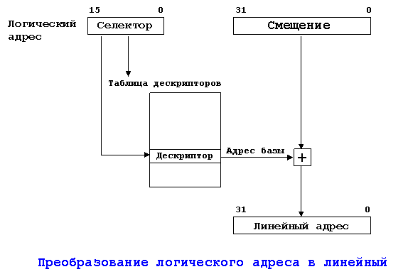

# ​Экзаменационный билет №12

## ​[O] Перечислите операторы ассемблера.

## ​Команды, используемые в ассемблере для поиска в строке.

### ​Поиск в строке: SCAS.

REPNE SCASB ищет в строке элемент, равный AL. REPE SCASB ищет не равный.


Сравнивает содержимое регистра AL (SCASB) или AX (SCASW) с байтом, словом или двойным словом из памяти по адресу ES:DI и устанавливает флаги аналогично команде СМР. При использовании формы записи SCAS ассемблер сам определяет по типу указанного операнда (принято указывать имя сканируемой строки, но можно использовать любой операнд подходящего типа), какую из двух форм этой команды (SCASB или SCASW) выбрать. После выполнения команды регистр DI увеличивается на 1 или 2 (если сканируются байты или слова), когда флаг DF = 0, и уменьшается, когда DF = 1. Команда SCAS с префиксами REPNE/REPNZ или REPE/REPZ выполняет сканирование строки длиной в СХ байтов или слов. В первом случае сканирование продолжается до первого элемента строки, совпадающего с содержимым аккумулятора, а во втором - до первого отличного.

## ​Страничная адресация. Отличия от сегментной, основные структуры данных, схема преобразования линейного адреса в физический.

*лекция 9 стр 1*

Если с сегментной проблем не возникло, страничная освоится так же легко. 
Прежде  всего,  нужно  понять  очень  важную  вещь:  при  использовании  страничной  адресации структуры из сегментной адресации (как то  –  таблицы дескрипторов, селекторы, регистры таблиц дескрипторов) никуда не деваются. Все остается на своих местах

Важный  момент:  единственное  место,  где  страничная  адресация  действительно  вклинивается  в процесс работы процессора – при переводе линейного адреса в физический

Вспомним три понятия: логический, линейный и физический адрес. Логический адрес – это некий абстрактный, на деле ничего не значащий адрес, грубо говоря, CS:EIP – это и есть логический адрес, в самом деле, что он может нам сообщить? Ничего. Только то, что если мы вытащим из CS поле индекс, а затем по этому полю найдем в таблице дескрипторов соответствующий дескриптор, а затем к базе из этого дескриптора прибавим EIP – то вот только тогда получим линейный адрес. При использовании сегментной адресации физический адрес совпадает с линейным (физический – это адрес, который процессор выставляет уже на адресную шину). Т.е. при сегментной адресации процессор просто берет линейный адрес и без изменений выставляет на адресную шину. При использовании страничной адресации именно на этапе перевода линейного адреса в физический в действие вступают новые преобразования.

**При использовании страничной адресации линейный адрес не совпадает с физическим, как в случае с сегментной адресацией**. Т.е. мы имеем дело с виртуальной памятью. Процессор делит линейное адресное пространство на страницы фиксированного размера (длиной 4Кб, 2Мб или 4Мб), которые, в
свою очередь, уже отображаются в физической памяти (или на диске). Когда программа (или задача) обращается к памяти через логический адрес, процессор переводит его в линейный и затем, используя механизму страничной адресации, переводит его в соответствующий физический адрес. Если страницы в данный момент нет в физической памяти, то возникает исключение #PF. Это, по сути, кульминационный момент: обработчик этого исключения (#PF) должен выполнить соответствующие манипуляции по устранению данной проблемы, т.е. подгрузить страницу с жесткого диска (или наоборот – скинуть ненужную страницу на диск).

По сути - #PF это не есть нечто ужасное и недопустимое (как #GP). Наоборот, без него вообще ничего бы и не получилось по сути дела.

Страничная организация отличается от сегментной еще и тем, что **все страницы имеют фиксированный размер (в сегментной размер сегментов абсолютно произволен)**. Также при сегментной адресации все сегменты обязательно должны присутствовать непосредственно в оперативной памяти, а при страничной возможна ситуация, когда кусок сегмента находится в памяти, а другой кусок фактически того же сегмента – на жестком диске (т.е. другими словами – часть страниц сегмента находится в памяти, а часть – валяется в то же время на диске).

Процессор всегда, где это возможно, облегчает себе жизнь. Вспомним про «теневую» часть
сегментного регистра. Также и в случае со страничной адресацией – страницы, к которым процессор чаще всего обращается, кэшируются в процессоре, в области, которая называется буфер с ассоциативной выборкой (TLB - Table lookaside buffer). Т.е. не все такие страницы целиком, а только записи, которые необходимы для доступа к ним.

Итак, страничная организация непосредственно в процессоре управляется тремя флажками:
* Флаг PG (paging): бит 31 в регистре CR0. Появился в 386 процессоре.
* Флаг PSE (page size extensions): бит 4 в регистре CR4. Появился в Pentium.
* PAE (physical address extension) flag: бит 5 в регистре CR4. Появился в pentium pro. 

Теперь подробнее. **Флаг PG разрешает страничную адресацию**. Сразу после установки его в единицу страничная адресация включена. 

**Флаг PSE**, если его установить, **позволяет использовать страницы больших размеров** (4Мб и 2Мб). Если сброшен – страницы имеют размер 4Кб.

Флаг **PAE позволяет расширить физический адрес до 36 бит** (стандартно он 32-х битный). Данный флаг можно использовать только в режиме страничной адресации.

Кстати, использовать 36-разрядную адресацию можно как с помощью PAE-флага, так и с помощью PSE-флага, это два разных метода, мы их рассмотрим дальше.

### Каталоги и таблицы страниц.

При трансляции линейного адреса в физический (при включенной страничной адресации) процессор использует 4 структуры данных:

* Каталог страниц – массив 32-битных записей (PDE – page-directory entry), которые хранятся в 4Кб странице. Напоминает таблицу дескрипторов. В 4 Кб 32-битных записи помещается 1024 штуки,
значит, всего 1024 PDE.
* Таблица страниц – массив 32-битных записей (PTE – page-table entry), которые также все расположены в одной 4Кб странице. Т.е. PTE-шек тоже может быть всего 1024 штуки. Забегая вперед – для 2Мб и 4Мб страниц таблица страниц вообще никак не используется – все решают только PDE-
шки.
* Сама страница – 4Кб, 2Мб или 4Мб кусок памяти
* Указатель на каталог страниц – массив 64-битных записей, каждая из которых указывает на каталог страниц. Эта структура данных используется процессором только при использовании 36-битной адресации.

Все эти таблицы позволяют обращаться к 4Кб или к 4Мб страницам при 32-х битной адресации и к 4Кб, 2Мб или 4Мб страницам при 36-битной адресации.
Смотрим на таблицу, какие флаги на что влияют:

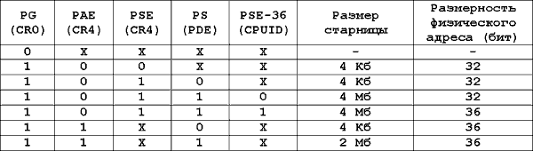

Непонятно тут может быть только одно – что за колонка PSE-36? Дело в том, что этот режим работы (PSE-36) появился только в Pentium 3, а доступен он или нет, можно узнать посредством CPUID. При использовании PSE-36 механизма доступны только страницы размером 4Мб. Фактически таким
образом можно адресовать 64 Gb физического адресного пространства.

При страничной организации существуют 3 способа адресации: 32-х
разрядная, 36-разрядная с использованием флага PAE и 36-разрядная с использованием флага PSE. 

Для начала рассмотрим самую простую и наглядную – 32-х разрядную адресацию. Все, о чем пойдет дальше речь – справедливо только для нее.

### Линейная адресная трансляция (4Кб страницы)

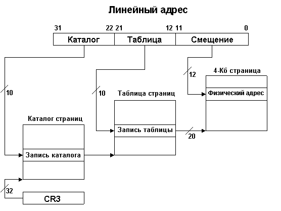

Линейный адрес (тот самый, который получается в результате сложения базы сегмента со смещением при сегментной организации) при страничной организации с 4Кб страницами делится на три части:
* Номер записи в каталоге страниц: биты 22-31.
* Номер записи в таблице страниц: биты 12-21.
* Смещение в самой 4Кб странице: биты 0-11.

Для справки: в регистре CR3 (см. рисунок) только биты 12-31 содержат смещение каталога страниц в памяти. Младшие 12 всегда равны нулю. Т.е. расположить каталог страниц ниже 4 Кб не удастся.

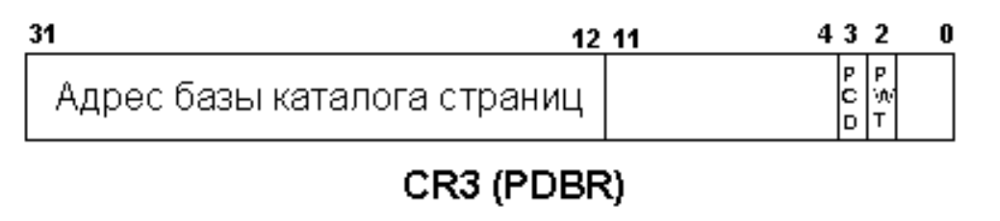

На самом деле, может создаться ошибочное мнение, что каталог страниц – один единственный, и указывает на него регистр CR3 (как в случае с глобальной таблицей дескрипторов и регистром GDTR). На самом же деле все обстоит совсем не так, каталогов страниц может быть несколько, даже у каждой задачи свой, а регистр CR3 меняется после переключения задачи.

### Линейная адресная трансляция (4Мб страницы)

Для 4Мб страниц никакой таблицы страниц не существует, всё решает каталог:

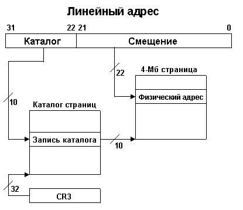

Фактически за счет размера страниц мы ничего не теряем и опять же можем адресовать 4Gb, как и в случае с 4Кб страницами. 4Мб размер страницы получается в случае установки флагов PSE и PS. Флаг PSE находится в CR4, а что за флаг PS? А флаг PS находится непосредственно в записи каталога
страниц, о которой позже.

В случае 4Мб страниц линейный адрес делится на ДВЕ части:
* Номер записи в каталоге страниц (биты 22-31)
* Смещение в самой 4Мб-странице (биты 0-21)

PCD-флаг (page level cache disabled) – контролирует кэширование каталога страниц. Если он установлен, то кэширование не происходит. Если сброшен – каталог страниц может кэшироваться. Этот флаг влияет только на внутренние кэши процессора. Процессор игнорирует этот флаг, еслистраничная адресация отключена (флаг PG в CR0 сброшен) или если вообще отключен кэш (флаг CD в CR0).

Регистр CR3 (главным образом, хранящий начало каталога страниц текущей задачи) также называют PDBR (page directory base register). Если мы собираемся использовать страничную адресацию, мы должны загрузить этот регистр в процессе инициализации. Загрузить его можно либо непосредственно командой mov, либо он сам загрузиться при переключении задач.

Может возникнуть ситуация, когда каталог страниц в момент переключения отсутствует в физической памяти, поэтому ОС перед переключением задачи должна устранить это недоразумение. Каталог страниц должен находится в памяти столько времени, сколько активна задача, использующая этот
каталог страниц.

### Элементы каталогов и таблиц страниц

Напомню, что при страничной организации линейный адрес (база из дескриптора + offset) не
соответствует физическому (т.е. адресу, который процессор выставляет на адресную шину). Прежде, чем попасть на адресную шину он проходит ряд преобразований.
Итак, линейный адрес делится на три части в случае 4Кб страниц, и на две в случае 4Мб страниц.
Рассмотрим случай с 4Кб страницами.

Биты 22-31 линейного адреса – это номер элемента (записи) в каталоге страниц. Адрес начала каталога страниц в памяти содержит регистр CR3. Каждый элемент в каталоге страниц «весит» 32 бита. Рассмотрим его.

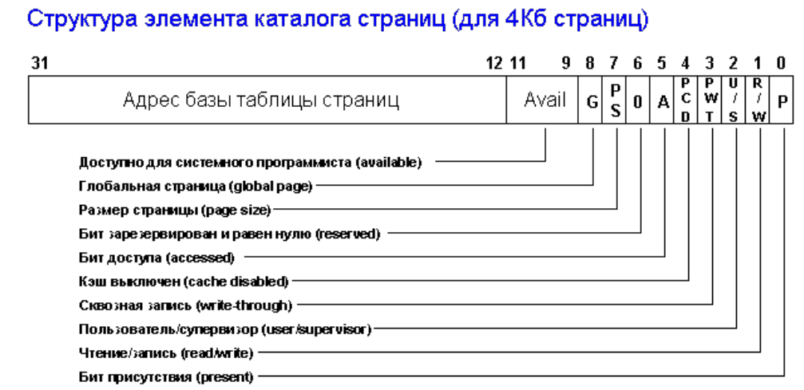

Поле «Адрес базы таблицы страниц» содержит адрес базы таблицы страниц. Т.е. не адрес элемента из таблицы страниц, а только адрес начала таблицы этих элементов. Сам элемент (его номер в таблице страниц) определяют биты 12-21 линейного адреса. Вот его структура:

* P-флаг, бит 0: указывает, находится ли страница (или таблица страниц) в физической памяти. Если он равен 1 – то все в порядке, страница в памяти и можно продолжать формирование физического адреса, если же он сброшен – процессор вызывает исключение #PF (Page Fault), обработчик которого должен загрузить ее в память. Вообще-то процессор никогда не меняет этот флаг сам – этим должна заниматься ОС.
* R/W-флаг, бит 1: определяет привилегии чтения/записи для страницы или группы страниц (в случае, когда элемент каталога страниц указывает на таблицу страниц). Если флаг сброшен – страница доступна только для чтения. Если установлен – для чтения и записи. Данный флаг тесно связан с флагами U/S и WP из CR0.
* U/S-флаг, бит 2: определяет привилегии пользователя/супервизора для страницы или группы страниц. Если флаг сброшен – страница доступна только для супервизорского уровня привилегий, если установлен – для пользователя и супервизора. Данный флаг связан с флагами U/S и WP.
* PWT-флаг, бит 3: контролирует кэширование страницы (write-through и write-back). В зависимости от того, установлен он или сброшен, доступны разные типы кэширования. Процессор игнорирует этот флаг, если установлен CD (cache disabled) флаг в CR0.
* PCD-флаг, бит 4: контролирует кэширование страницы. Если установлен – кэширование страницы отключено, если сброшен – разрешено. Нужен для страниц, которые, по сути, могут только засорить кэш и не нужны для частого использования. Также, как и с PWT-флагом, значение PCD-флага игнорируется, если установлен CD-флаг в CR0.
* A-флаг, бит 5: (аналог флага А в дескрипторе) показывает, было ли произведено обращение к странице с момента загрузки ее в память. По идее, ОС при загрузке страницы в память в первый раз должна сбросить этот бит в ноль. Затем, после ее загрузки в память, процессор отлавливает момент, когда к ней в первый раз произойдет обращение и сам устанавливает этот флаг в единицу. И все, больше он его не трогает. Флаг А (также как и D) нужны для управления и контроля за страницами и таблицами страниц.
* D-флаг, бит 6: показывает была ли произведена запись в страницу. Этот флажок игнорируется в элементах каталога страниц, которые указывают на таблицы страниц, т.е. при 4Кб-страничной организации. ОС должна обнулить данный флаг как только страница загружена в память, затем процессор уже сам установит его, как только в страницу будет произведена первая запись и больше его трогать не будет. Т.е. он будет торчать до тех пор, пока его не скинет ОС. Вообще данный флаг по сути схож с флагом A.
* PS-флаг, бит 7 (для 4Кб страниц): определяет размер страницы. Если сброшен – страница 4Кб и элемент каталога страниц указывает на таблицу страниц. Если установлен – страница 4Мб (при 32-хбитной адресации) или 2Мб (если используется EPA) и элемент каталога страниц указывает на саму страницу. Если элемент каталога страниц указывает на таблицу страниц, то все страницы, на которые ссылаются элементы таблицы страниц также являются 4Кб-ными.
* G-флаг, бит 8: появился в Pentium Pro процессорах. Указывает, что описываемая страница является глобальной, если установлен. Если данный флаг установлен, а также установлен PGE-флаг в CR4, то соответствующие элементы каталога и таблицы страниц никогда не будут выкинуты из кэша. Страницы, содержащие код ядра ОС и т.п. желательно помечать глобальными, тогда их никто не посмеет выкинуть из кэша. Флаг G можно установить/сбросить только программно. Для элементов каталога, которые указывают на таблицу страниц, этот бит игнорируется, зато точно такой же бит есть и в соотв. элементе таблицы страниц, вот там процессор на него уже смотрит.
* Зарезервированные и доступные для программ биты: существуют во всех IA-32 процах. Биты 9,10 и 11 доступны для использования программно. Если бит P (бит присутствия сегмента) сброшен, то доступны все 32 бита. Для элемента каталога страниц, который указывает на таблицу страниц, бит 6 должен всегда равняться нулю. Если PSE и PAE флаги в CR4 – установлены, то процессор будет кидать исключение #PF, если зарезервированные биты не сброшены в нули.


# ​Экзаменационный билет №13

## ​Команды, используемые в ассемблере для сравнения строк.

### ​Сравнение строк: CMPS

CMPS сравнивает пару элементов DS:SI с ES:DI. Также автоматически производит инкремент обоих указателей, при DF – 0.


Сравнивает один байт (CMPSB) или слово (CMPSW) из памяти по адресу DS:SI с байтом или словом по адресу ES:DI и устанавливает флаги аналогично команде СМР. При использовании формы записи CMPS ассемблер сам определяет по типу указанных операндов (принято указывать имена сравниваемых строк, но можно использовать любые два операнда подходящего типа), какую из двух форм этой команды (CMPSB или CMPSW) выбрать.

Применяя CMPS с операндами, можно заменить регистр DS другим, воспользовавшись префиксом замены сегмента (ES:, GS:, FS:, CS:, SS:), регистр ES заменить нельзя. После выполнения команды регистры SI и DI увеличиваются на 1 или 2 (если сравниваются байты или слова), когда флаг DF = 0, и уменьшаются, когда DF = 1.

Команда CMPS с префиксами REPNE/REPNZ или REPE/REPZ выполняет сравнение строки длиной в СХ байтов или слов. В первом случае сравнение продолжается до первого совпадения в строках, а во втором — до первого несовпадения.

Сравнение строк: CMPS.

```asm
    CLD
    LEA SI, S1
    LEA DI, S2
    MOV CX, N
    REPE CMPSB
    JE EQ
NOEQ:
```

## ​В чём различия между макросами и подпрограммами?

Отличие от подпрограмм:

- Оттранслированный макрос подставляется во все места, где происходил его вызов
- После работы макроса не требуется осуществлять возврат
- Макрос можно переопределить или уничтожить

### ​Сравнительный анализ процедур и макросредств

Повторяющиеся действия (фрагменты) в программе можно описать и как процедуру, и как

макроопределение. При этом в обоих случаях повторяющийся участок кода описан только один раз, а обращаемся к нему с помощью одной команды (вызов процедуры или макрокоманда). Но...

После трансляции процедура так и останется описанной один раз, а тело макроопределения

подставится во все места вызова и тем самым увеличит размер программы.

### ​Вывод 1. Применение процедур делает код более компактным, т.е. экономим память

Но при обращении к процедуре

а) выполняется засылка параметров в регистры или стек,

б) запоминается адрес возврата

в) осуществляется переход,

г) по окончании работы процедуры восстанавливается адрес возврата,

д) очищаются регистры или стек и т.п.

Итак, при работе процедуры тратится время на переходы и передачу параметров во время

выполнения программы.

!!! При замене макрокоманд на макрорасширения тоже тратится время, но это происходит на этапе трансляции, а не во время выполнения программы.

### ​Вывод 2. Применение макросредств экономит время выполнения программы.

Поэтому в программах критических по времени следует применять макросредства, а если

необходимо экономить память следует применять процедуры.

Если в повторяющемся участке кода много команд (т.е. большой фрагмент) лучше описать его как процедуру. Если же небольшую группу команд описать процедурой, то число вспомогательных команд по ее вызову и передаче параметров станет сравнимым с числом команд самой процедуры, ее время выполнения станет на много больше.

### ​Вывод 3. Большие участки кода рекомендуется описывать как процедуры, а маленькие — как макроопределения.

!!! Еще одно отличие использования макросредств и процедур заключается в том, что параметрами процедур могут быть только операнды команд, а параметрами макрокоманд могут быть любые последовательности символов, в том числе и сами команды.

## Опишите процедуру переключения процессора из реального режима в защищенный.

*лекция 8 стр 9*

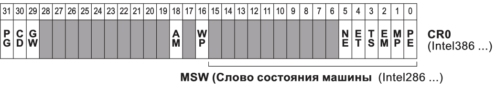

CR – Control Register. Регистр, который отвечает за управление процессором и режимами его работы. В нем много различных полей, и вдаваться в подробности каждого сейчас не будем, но скажу лишь, что переход в защищенный режим осуществляется установкой бита PE (Protected Enabled, самый младший бит регистра) в значение 1. Доступ регистру возможен через инструкции

```asm
MOV CR0, AX
LMSW AX/SMSW AX
```

Source: [wiki](https://en.wikipedia.org/wiki/Protected_mode#Entering_and_exiting_protected_mode)

To enter protected mode, the Global Descriptor Table (GDT) must first be created with a minimum of three entries: a null descriptor, a code segment descriptor and data segment descriptor. In an IBM-compatible machine, the A20 line (21st address line) also must be enabled to allow the use of all the address lines so that the CPU can access beyond 1 megabyte of memory (Only the first 20 are allowed to be used after power-up, to guarantee compatibility with older software written for the Intel 8088-based IBM PC and PC/XT models).After performing those two steps, the PE bit must be set in the CR0 register and a far jump must be made to clear the prefetch input queue.

```asm
; MASM program
; enter protected mode (set PE bit)
mov EBX, CR0   ; save control register 0 (CR0) to EBX
or EBX, PE_BIT ; set PE bit by ORing, save to EBX
mov CR0, EBX   ; save EBX back to CR0

; clear prefetch queue; (using far jump instruction jmp)
jmp CLEAR_LABEL
CLEAR_LABEL:
```

# ​Экзаменационный билет №14

## ​Инструкции двоично-десятичной коррекции.

Вспомним про флаг AF - флаг полупереноса или вспомогательного переноса. Устанавливается в 1, если в результате предыдущей операции произошел перенос (или заем) из третьего бита в четвертый. Этот флаг используется автоматически командами двоично-десятичной коррекции. Процессоры Intel поддерживают операции с двумя форматами десятичных чисел: неупакованное двоично-десятичное число - байт, принимающий значения от 00 до 09h, и упакованное двоично-десятичное число - байт, принимающий значения от 00 до 99h. Все обычные арифметические операции над такими числами приводят к неправильным результатам. Например, если увеличить 19h на 1, то получится число 1Ah, а не 20h. Для коррекции результатов арифметических действий над двоично-десятичными числами используются приведенные ниже команды.

### ​DAA - коррекция после сложения

Если эта команда выполняется сразу после ADD (ADC, INC) и в регистре AL находится сумма двух упакованных двоично-десятичных чисел, то в AL записывается упакованное двоично-десятичное число, которое должно было стать результатом сложения. Например, если AL содержит число 19h, последовательность команд

```asm
inc al
daa
```

приведет к тому, что в AL окажется 20h (а не 1 Ah, как было бы после INC). DAA выполняет следующие действия:

1. Если младшие четыре бита AL больше 9 или флаг AF = 1, то AL увеличивается на 6, CF устанавливается, если при этом сложении произошел перенос, и AF устанавливается в 1.
2. Иначе AF = 0.
3. Если теперь старшие четыре бита AL больше 9 или флаг CF = 1, то AL увеличивается на 60h и CF устанавливается в 1.
4. Иначе CF = 0.

Флаги AF и CF устанавливаются, если в ходе коррекции происходил перенос из первой или второй цифры. SF, ZF и PF устанавливаются в соответствии с результатом, флаг OF не определен.

### ​DAS - коррекция после вычитания

Если эта команда выполняется сразу после SUB (SBB или DEC) и в регистре AL находится разность двух упакованных двоично-десятичных чисел, то в AL записывается упакованное двоично-десятичное число, которое должно было быть результатом вычитания. Например, если AL содержит число 20h, последовательность команд

```asm
dec al
das
```

приведет к тому, что в регистре окажется 19h (а не 1Fh, как было бы после DEC). DAS выполняет следующие действия:

1. Если младшие четыре бита AL больше 9 или флаг AF = 1, то AL уменьшается на 6, CF устанавливается, если при этом вычитании произошел заем, и AF устанавливается в 1.
2. Иначе АF = 0.
3. Если теперь старшие четыре бита AL больше 9 или флаг CF — 1,то AL уменьшается на 60h и CF устанавливается в 1.
4. Иначе CF = 0.

Известный пример необычного использования этой команды - самый компактный вариант преобразования шестнадцатеричной цифры в ASCII-код соответствующего символа:

```asm
сmp al,10
sbb al,69h
das
```

После SBB числа 0-9 превращаются в 96h - 9Fh, а числа 0Ah - 0Fh - в 0A1h - 0A6h. Затем DAS вычитает 66h из первой группы чисел, переводя их в 30h - 39h, и 60h из второй группы чисел, переводя их в 41h — 46h.

## Использование встроенного ассемблера (ассемблерных вставок) в языках более высокого уровня.

### Вставки

Мы можем указать компилятору вставить код функции в тот участок кода, где она вызывается, то есть в то место, где выполняется вызов функции. Такая функция называется встроенной.

Встроенный ассемблер - это просто некоторые ассемблерные сборки, написанные, как встроенные функции.

Нашим основным направлением является изучение основных форматов и использования ассемблерной функции. Для объявления ассемблерной функции мы используем ключевое слово asm.

Встроенный ассемблер важен, в первую очередь, из-за его способности выполнять операции и быть видимым для переменных C/С++. Из-за этой возможности "asm" работает в качестве интерфейса между инструкциями ассемблера и программой на С/С++, в которой он содержится.

Существуют следующие формы комбинирования программ на языках высокого уровня с ассемблером: Использование ассемблерных вставок (встроенный ассемблер, режим inline). Ассемблерные коды в виде команд ассемблера вставляются в текст программы на языке высокого уровня. Компилятор языка распознает их как команды ассемблера и без изменений включает в формируемый им объектный код. Эта форма удобна, если надо вставить небольшой фрагмент.


Использование внешних процедур и функций. Это более универсальная форма комбинирования. У нее есть ряд преимуществ:
— написание и отладку программ можно производить независимо;
— написанные подпрограммы можно использовать в других проектах;
— облегчаются модификация и сопровождение подпрограмм.
Встроенный ассемблер. При написании ассемблерных вставок используется следующий синтаксис:

`_asm КодОперации операнды ; // комментарии`

КодОперации задает команду ассемблера,

операнды – это операнды команды.

В конце записывается ;, как и в любой команде языка Си.

Комментарии записываются в той форме, которая принята для языка Си.

Если требуется в текст программы на языке Си вставить несколько идущих подряд команд ассемблера, то их объединяют в блок:

```c
_asm
{
текст программы на ассемблере ; комментарии
}
```

Внутри блока текст программы пишется с использованием синтаксиса ассемблера, при необходимости можно использовать метки и идентификаторы. Комментарии в этом случае можно записывать как после ;, так и после //.

### Использование внешних процедур

#### Соглашения о вызове

Для связи посредством внешних процедур создается многофайловая программа. При этом в общем случае возможны два варианта вызова:

* программа на языке высокого уровня вызывает процедуру на языке ассемблера;
* программа на языке ассемблера вызывает процедуру на языке высокого уровня.

Рассмотрим более подробно первый вариант: для этого необходимо остановиться на одной важной теме, которой мы уже касались при описании корректных вызовов процедур на ассемблере – соглашения о вызовах.

Соглашение о вызове (англ. calling convention) — описание технических особенностей вызова
подпрограмм, определяющее:

* способы передачи параметров подпрограммам;
* способы вызова (передачи управления) подпрограмм;
* способы передачи результатов вычислений, выполненных подпрограммами, в точку вызова;
* способы возврата (передачи управления) из подпрограмм в точку вызова.

Является частью двоичного интерфейса приложений (англ. application binary interface, ABI).
Соглашение о вызове описывает следующее:

* способ передачи аргументов в функцию. Варианты:
  * аргументы передаются через регистры процессора;
  * аргументы передаются через стек;
  * смешанные (соответственно, стандартизируется алгоритм, определяющий, что передаётся через регистры, а что — через стек или другую память):
    * первые несколько аргументов передаются через регистры; остальные — через стек (небольшие аргументы) или другую память (большие аргументы);
    * аргументы небольшого размера передаются через стек, большие аргументы — через другую память;
* порядок размещения аргументов в регистрах и/или стеке. Варианты:
  * слева направо или прямой порядок: аргументы размещаются в том же порядке, в котором они перечислены при вызове функции. Достоинство: машинный код соответствует коду на языке высокого уровня;
  * справа налево или обратный порядок: аргументы передаются в порядке от конца к началу. Достоинство: упрощается реализация функций, принимающих произвольное число аргументов (например, printf()) (так как на вершине стека оказывается всегда первый аргумент);
* код, ответственнКонвенция Pascalованных языках. Варианты (для процессора x86, работающего в защищённом режиме):
  * как первый аргумент;
  * через регистр ecx или rcx;
* код, ответственный за сохранение и восстановление содержимого регистров до и после вызова функции:
  * вызывающая функция;
  * вызываемая функция;
* список регистров, подлежащих сохранению/восстановлению до/после вызова функции.

Соглашение о вызове может быть описано в документации к ABI архитектуры, в документации к ОС или в документации к компилятору.

В таблице ниже представлены основные соглашения по передаче параметров в процедуру.

В программах, написанных на языке ассемблера, используется соглашение передачи параметров stdcall. Однако по сути получение и передача параметров в языке ассемблера производится явно, без помощи транслятора.

При связи процедуры, написанной на языке ассемблера, с языком высокого уровня, необходимо учитывать соглашение по передаче параметров.

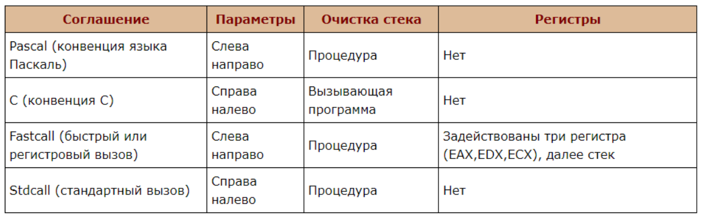

#### Конвенция Pascal

Конвенция Pascal заключается в том, что параметры из программы на языке высокого уровня передаются в стеке и возвращаются в регистре АХ/ЕАХ, — это способ, принятый в языке PASCAL (атакже в BASIC, FORTRAN, ADA, OBERON, MODULA2), — просто поместить параметры в стек в естественном порядке. В этом случае запись

```pascal
some_proc(a,b,c,d);
```
запишется как
```asm
push a
push b
push с
push d
call some_proc@16
```

Процедура `some_proc`, во-первых, должна очистить стек по окончании работы (например, командой ret 16) и, во-вторых, параметры, переданные ей, находятся в стеке в обратном порядке:

```asm
some_proc proc
  push ebp
  mov ebp,esp
  mov eax, [ebp+20] ; a
  mov ebx, [ebp+16] ; b
  mov ecx, [ebp+12] ; c
  mov edx, [ebp+8] ; d
  …
  pop ebp
  ret 16
some_proc endp
```

Этот код в точности соответствует полной форме директивы `proc`. Однако можно использовать упрощенную форму, которую поддерживают все современные ассемблеры:

```asm
some_proc proc PASCAL, а:dword, b:dword, с:dword, d:dword
  …
  ret
some_proc endp
```

**Главный недостаток** этой конвенции — сложность создания функции с изменяемым числом параметров, аналогичных функции языка С printf. Чтобы определить число параметров, переданных printf, процедура должна сначала прочитать первый параметр, но она не знает его расположения в стеке. Эту проблему решает подход, используемый в С, где параметры передаются в обратном порядке.

#### Конвенция С

Конвенция С используется, в первую очередь, в языках С и C++, а также в PROLOG и других. **Параметры помещаются в стек в обратном порядке**, и, в противоположность PASCAL-конвенции, **удаление параметров из стека выполняет вызывающая процедура**.

Запись
```c
some_proc(a,b,c,d);
```
будет выглядеть как
```asm
push d
push с
push b
push a
call some_proc
add esp, 16 ; освободить стек
```
Вызванная таким образом процедура может инициализироваться так:
```asm
some_proc proc
  push ebp
  mov ebp,esp
  mov eax, [ebp+8] ; a
  mov ebx, [ebp+12] ; b
  mov ecx, [ebp+16] ; c
  mov edx, [ebp+20] ; d
  …
  pop ebp
  ret
some_proc endp
```

Трансляторы ассемблера поддерживают и такой формат вызова при помощи полной формы директивы `proc` с указанием языка С:

```asm
some_proc proc С, а:dword, b:dword, с:dword, d:dword
  …
  ret
some_proc endp
```

Регистр EВР используется для хранения параметров, и его нельзя изменять программно при
использовании упрощенной формы директивы `proc`. Преимущество по сравнению с PASCAL-конвенцией заключается в том, что освобождение стека от параметров в конвенции С возлагается на вызывающую процедуру, что позволяет лучше оптимизировать код программы. Например, если необходимо вызвать несколько функций, принимающих одни и те же параметры подряд, можно не заполнять стек каждый раз заново, и это — одна из причин, по которой компиляторы с языка С создают более компактный и быстрый код по сравнению с компиляторами с других языков.

#### Смешанные конвенции

* **STDCALL**
  * Применяется для всех системных функций Win32 API. Здесь параметры помещаются в стек в обратном порядке, как в С, но процедуры должны очищать стек сами, как в PASCAL.
* **FASTCALL**
  * Параметры в функции также передаются по возможности через регистры. Например, при вызове функции с шестью параметрами
  ```c
  some_proc(a,b,с,d,e,f);
  ```
  первые три параметра передаются соответственно в ЕАХ, EDX, ЕСХ, а только начиная с четвертого, параметры помещают в стек в обычном обратном порядке:
  ```asm
  mov a, eax
  mov b, edx
  mov c, ecx
  mov d, [ebp+8]
  mov e, [ebp+12]
  mov f, [ebp+16]
  ```
  В случае если стек был задействован, освобождение его возлагается на вызываемую процедуру. В случае быстрого вызова транслятор Си добавляет к имени значок @ спереди, что искажает имена при обращении к ним в ассемблерном модуле.

#### Возврат результата из процедуры 
Возврат результата из процедуры. Чтобы возвратить результат в **программу на С** из процедуры на ассемблере, перед возвратом управления в вызываемой процедуре (на языке ассемблера) необходимо поместить результат в соответствующий регистр:

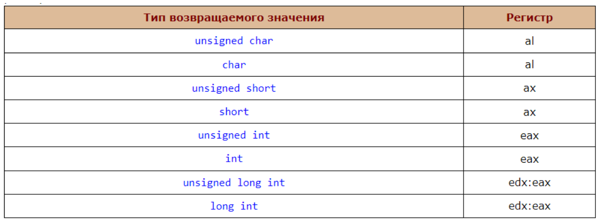

Возвращаемые значения более сложных типов всё равно передаются через eax или его вариации (al, ax), но в таком случае через этот регистр передаётся ссылка на значение, а не оно само.

```cpp
//Вызывающая программа file1.cpp
#include <iostream>

using namespace std;

extern «C» int MAS_FUNC (int *, int);

int main() {
  int *mas, n, k;
  system("chcp 1251");
  system("cls");
  cout << "Введите размер массива: ";
  cin >> n;
  mas = new int[n];
  cout << "Введите элементы массива: " << endl;
  for(int i=0; i<n; i++) {
    cout << "mas[" << i <<"]= ";
    cin >> mas[i];
  }
  k = MAS_FUNC(mas, n);
  cout << mas[1] << "*2= " << k;
  cin.get(); cin.get();
  return 0;
}
```

```asm
;Вызываемая функция file2.asm
.586
.MODEL FLAT, C
.CODE
MAS_FUNC PROC C mas:dword, n:dword
  mov esi,mas
  mov eax, [esi+4]
  shl eax, 1
  ret
MAS_FUNC ENDP
END
```

В общем виде в соглашении о вызовах учитываются следующие моменты:
* декорирование имён подпрограмм позволяет реализовать регистро-зависимые и независимые имена, а также перегрузку и совпадающие имена в различных контекстах (в различных пространствах имён, модулях, классах, локальные имена и т. п.);
* способы и порядок передачи аргументов в подпрограмму определяет и порядок вычислений аргументов, и порядок размещения их в памяти; 
  * способ передачи может различаться для аргументов различных типов (простые переменные нативных типов, переменные сложных составных типов, массивы и т. п.);
* наличие и число неявных аргументов определяет необходимость или возможность передачи в подпрограмму некоторых неявных параметров 
  * например, таких как указатель на экземпляр объекта (`this` в C++), указатель на фрейм объемлющей функции и т. п.;
* способы возвращения результата выполнения функции: 
  * на практике для разных типов используются разные способы (для целых чисел регистры ЦПУ, для вещественных часто используются регистры процессора вещественных чисел, для структур и объектов используются более сложные механизмы);
* механизм обработки исключений важен для языков программирования, предусматривающих такую возможность; 
  * этот механизм является достаточно дорогостоящим и его лучше не превращать в нормальный механизм изменения порядка вычислений: обработка исключений целесообразна, как правило, лишь для обработки разрушающих ошибок, чтобы программа завершила работу с информативным сообщением, вместо завершения с малопонятной ошибкой типа «General protection fault»;
* способ освобождения динамически выделяемых ресурсов; 
  * такими ресурсами являются, по большому счёту, сами фреймы вызова подпрограмм, включая все их внутренние части: область аргументов, служебные поля, фрейм обработчика исключений, область локальных переменных и т. п.; 
  * существенными являются два момента: 
    * когда происходит освобождение (в вызывающем или вызываемом коде и в каком порядке)
    * какими средствами это освобождение выполняется (специальными функциями, перемещением указателя стека и пр.);
* способ вызова подпрограмм 
  * определяет используемый набор инструкций процессора для вызова подпрограмм (`call` ..., условные или безусловные переходы с сохранением адреса возврата, программные прерывания, специальные инструкции для вызова подпрограмм и т. п.) и соответствующие инструкции для возврата из подпрограммы, что влияет на содержимое фрейма, смещения отдельных частей фрейма по отношению друг к другу и затраты для выполнения вызовов подпрограмм;
* ограничения на использование регистров 
  * определяет список регистров, значение которых может быть изменено произвольным образом (т. н. временные регистры, scratch registers); вызывающий код должен считать, что после вызова любой подпрограммы эти регистры получают произвольные, заранее неизвестные значения и в них нельзя хранить никаких переменных; остальные регистры (защищённые соглашением), если только они не используются для возвращения аргументов, не должны изменяться после вызова подпрограммы. С точки зрения подпрограммы временные регистры и регистры, используемые для возвращения результата, можно использовать совершенно свободно, а все остальные надо сначала сохранить (например, в стеке), и восстановить перед выходом из подпрограммы.

#### Итог
* Синтаксис встроенного ассемблера: 
  ```c
  __asm инструкция
  ```
  или
  ```c
  __asm {
  инструкция
  инструкция
  ...
  }
  ```
* Ассемблерные инструкции — специальный Intel-подобный синтаксис, распознаваемый компилятором C/C++. Различие между инструкциями разной разрядности вынесено в синтаксис;
  * например, `pushf` — поместить в стек слово флагов (т.е. 16 бит, хотя режим 32х или даже 64х разрядный); `pushfd` — поместить в стек двойное слово флагов и т.п.
* Директивы ассемблера (db, dw, segment и т.п.) не поддерживаются совсем.
* Переменные и процедуры C/C++ программы непосредственно доступны по их именам в ассемблерном коде с проверкой их типа и размера.
* Оптимизация внедренного ассемблерного кода **не выполняется**.

Отсутствие оптимизации ассемблерного кода позволяет использовать так называемые **барьеры**.

**Барьеры** — средство определить очередность выполнения каких-либо операций; т.е. вся последовательность действий, предшествующая барьеру должна быть выполнена до того, как начнется выполнение каких-либо действий, описанных после барьера.

**Барьеры оптимизации** — обычно реализованы как вставки пустого ассемблерного кода; оптимизатор не перемещает инструкции через такую вставку.

**Барьеры памяти** — атомарные операции.

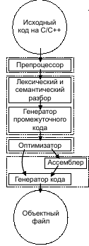

Последнее, что стоит отметить – такой синтаксис работы встроенного ассемблера работает не на всех компиляторах. Рассмотрим, чем отличается синтаксис встроенного ассемблера для компилятора gcc. 

```c
asm [volatile] ( «ассемблерный код» : «выходные параметры» : «входные параметры» : «побочные эффекты» );
```
1. Ассемблерный код - произвольный текст, заключенный в кавычки; корректность внедренного ассемблера проверяется только на этапе трансляции с ассемблера. 
2. Директивы ассемблера. Можно включать любые инструкции и директивы, поддерживаемые ассемблером AT&T.
3. Переменные и процедуры C/C++ доступны во внедренном коде с помощью описания групп выходных и входных параметров. Возможна вариативность внедренного ассемблера в зависимости от типов и размеров параметров.
4. Побочные эффекты должны быть описаны явным образом, включая модификацию регистров, содержимого памяти и т.п.
5. Внедренный ассемблер является объектом оптимизации как неделимый блок; может быть перемещен в другое место кода, изменена очередность блоков и т.п. 
   
Для корректной компиляции требуется строгое описание входных и выходных параметров и побочных эффектов. Предусмотрено задание внедренного ассемблера, запрещенного для перемещения при
оптимизации:

`asm` (может быть перемещен оптимизатором)
`asm volatile` (не может быть перемещен оптимизатором)
Внедренный ассемблер используется для реализации т.н. «барьеров оптимизации»:
```c
#define OBARRIER asm volatile(“”)
```

## ​Отличия между синтаксисами ассемблера Intel и AT&T.

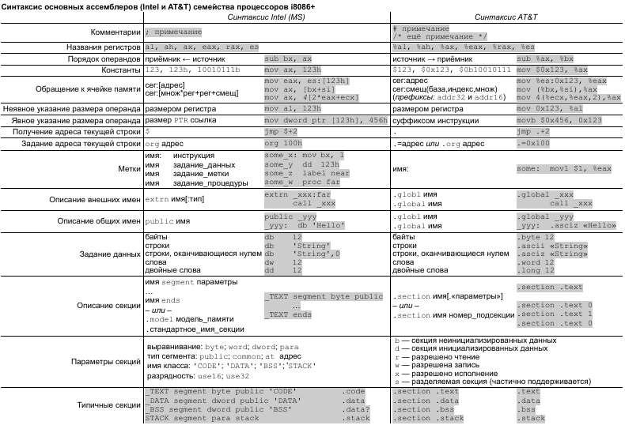